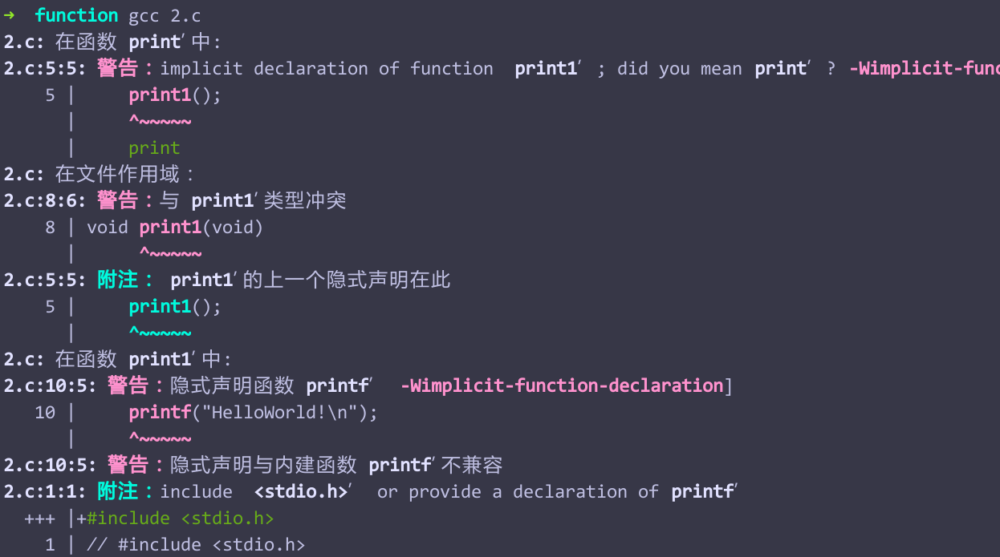
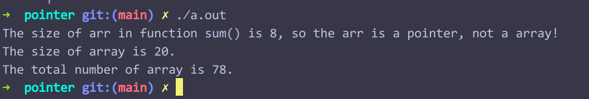
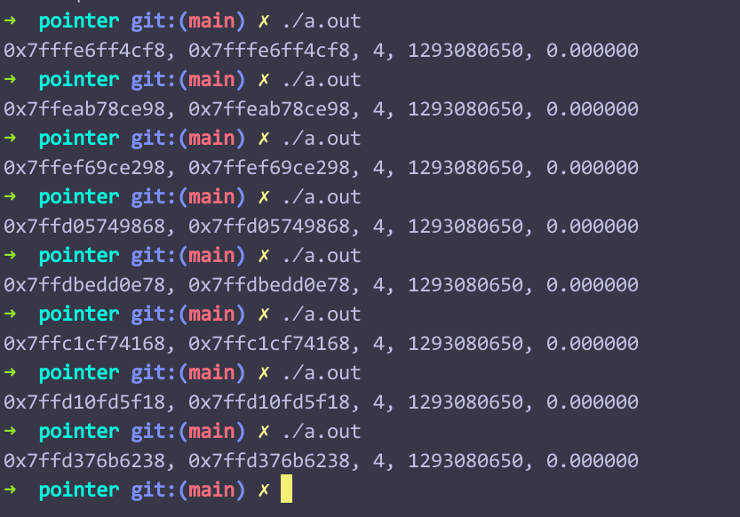

## 输入/输出字符和文件操作

### 重定位

在Linux中，一切皆是文件，I/O设备是 输入/输出 文件，键盘输入字符，就是在打开输入文件进行操作的过程。

C程序通过**流**来进行文件操作，**流**是对实际文件的映射。

重定位就是用其他文件来代替I/O文件，以达到输入、输出的效果

```shell
$ ./prog > 1.txt
----将程序的输出输到1.txt中


$ ./prog < 1.txt
----将1.txt中的文本内容当作对程序的输入


$ ./prog < 1.txt > 2.txt
----将1.txt中的文本内容当作对程序的输入，程序的输出输到2.txt中

```

> 注意事项：
1. 重定向符号只能连接文件和程序
2. 重定向符号不能同时将多个文件输入到一个程序中，也不能把输出重定向到多个文件


### 缓冲区
命令行输入有缓冲区，这就导致使用scanf()、getchar()等函数时输入的换行符可能会给程序带来不必要的麻烦，因此，当我们在循环读取单个字符的输入时，需要写一个while()语句来清除多余的输入，**尤其是换行符**。
```C
#include <stdio.h>

int main(void)
{
    char ch;
    int guess = 1;
    printf("%d?\n", guess);
    while ((ch = getchar()) != 'y' && guess <= 100)
    {
        while (getchar() != '\n')
            continue;
        if ('n' == ch)
            printf("Is it %d?\n", ++guess);
        else
            printf("Sorry, I can't understand your mean, please input again: ");
    } 
    printf("OK, I'm right!\n");
    return 0;
}
```

scanf()在输入数值时，不考虑空白符号，但如果用scanf()输入数值后，换行符仍会残留在缓冲区中，接下来如果有用getchar()或者用scanf()（输入字符时会有影响，如果是输入数值，并不会有设么影响，空白符会被忽略），这个换行符会影响程序的结果，这个时候，就需要使用while()来消除这个换行符或者在用scanf()输入字符时在%c之前添加一个空格。

示例：
```C
#include <stdio.h>

int main(void)
{
    int num;
    scanf("%d", &num);
    char ch;
    scanf(" %c", &ch);
    printf("%d, %c呵呵\n", num, ch);
    return 0;
}
```

### scanf()的一些问题：

1. scanf()在接收到预期的格式化输入后，会返回1（有几个接收就返回多少）。
2. 对于scanf("%d", num)来说，如果输入值是字符，则会将一个垃圾值赋给num，（如果这个放在while (scanf("%d", &num)) printf("xx")中，输入字符会导致预料外的问题，因为字符一旦没被处理，每次迭代时都会使用这个字符），如果输入的是浮点数，会将小数点前的数据赋给num，将小数点作为字符放置到缓存区，小数点后的数据将被清除。
3. scanf()接收到的键盘输入其实都是字符，但会根据格式化符号将字符转化成相应格式的数据。


## 第九章 函数
> 输入（参数） $\rightarrow$ （函数）处理 $\rightarrow$ 输出返回值

### 为什么需要函数
1. 让程序**模块化**
2. 提高程序的可读性
3. 能重复调用一个功能，并不需要每次使用这个功能时才编写（这样太费事儿）

### 函数的使用
1. 函数声明（函数原型）
2. 函数定义
3. 调用函数

> 注意事项：要想正确地使用函数，在使用前必须知道被调函数的类型（返回值的类型），函数的类型由函数声明来告知编译器，被调函数的声明必须放在使用该函数之前，可以放在主调函数的外面，也可以放在主调函数的里面，例如：
```C
        int main(void)
        {   ...
            int functionA(int, int);
            functionA(1, 2);
            ...
        }
```

> 被编译器报警告的例子：

```C
    // #include <stdio.h>
    void print(void)
    {
    //    #include <stdio.h>
        print1();
    }

    void print1(void)
    {
        printf("HelloWorld!\n");
    }

    int main(void)
    {
        #include <stdio.h>
        print();
        return 0;
    }
```


> [隐式声明](https://blog.csdn.net/smstong/article/details/50523120)


### 声明一个函数
返回值 函数名(参数)

```C
int functionA(int a, int b);
// 定义形式参数时可以省略变量名
// int functionA(int , int );
```

#### 参数
1. 实际参数可以是 变量、常量、表达式（在求值后复制给形式参数）。
2. 如果函数原型中有参数，在声明函数时，并不会为参数分配空间，只有在调用该函数时，才会声明变量并初始化为实际参数的值。
> 实现原理：调用被调函数$B$时，主调函数$A$将实际参数以**函数声明时的数据类型**压入栈中，控制权转交给被调函数。

```C
    #include <stdio.h>

    int test(int a, int b);

    int main(void)
    {
        printf("%d\n", test(1.0333, 2.0333));
        return 0;
    }

    int test(int a, int b)
    {
        return a + b;
    }
```


#### return
1. 向主调函数返回一个值
2. 终止被调函数并把控制权转交给主调函数的下一条语句
3. “return ; ”$\rightarrow$   用于没有返回值为void类型的函数

### 额外的记录
使用函数原型时指定参数与不指定参数：
1. 不指定参数带来的弊端：

```C
#include <stdio.h>

int test();

int main(void)
{
    printf("%d\n", test(1));
    return 0;
}

int test(int a, int b)
{
    return a + b;
}
```
输出一个垃圾值：因为会使用栈中其他位置的数值作为第二个参数进行计算。

2. 指定参数的数量、类型后，编译器能：
    1. 查询实际参数与形式参数的个数是否匹配
    2. 如果实际参数的类型与形式参数不同，那么会将实际参数的类型转换为形式参数的类型并赋给形式参数 

### 递归
函数自己调用自己
> 在C语言中，函数调用自己和调用其他函数并没有区别

#### 尾递归
尾递归发生在return语句之前，相当于循环。


## 指针
指针用来访问内存中的数据

~~指针就是地址~~

指针是一种变量类型，指针变量的值是地址，指针变量的赋值方式和其他类型的变量不同。
```C
int num;
int * ptr = &num;

// ptr指向变量num所在的内存空间，通过 * 来使用/修改num的值，（解引用）
```

### & 和 int *

**&**是（指针）常量，int * 定义的是指针变量


## 数组

### 声明数组和数组初始化

> 数组长度问题

```C
// 方法一：
#define LENGTH  5
...
int array_1[LENGTH] = {1, 2, 3, 4, 5};
int array_2[10];
// 直接指明数组的长度

// 方法二：由编译器来确定数组的长度
int array[] = {1, 2, 3, 4, 5};
// 确定数组的长度：
/*
    int length = sizeof array / sizeof array[0]
*/

```
> 数组初始化

1. 如果不初始化数组，那么数组内的元素全部存储的垃圾值
2. 如果只初始化一部分，那么剩下的元素都会被初始化为0
3. array[0]为数组的首元素
4. C99规定可以使用**指定初始化**：可以在初始化列表中使用带方括号的下表指明待初始化的元素：
```C
int array[5] = {[0] = 1, [2] = 3};
/*
下标：  0   1   2   3   4
数值    1   0   0   3   0
*/
```

> 数组越界

```C
#incldue <stdio.h>

int main(void)
{
    int num1 = 0;
    int array[4];
    int num2 = 0;

    array[-1] = -1;
    array[4] = 100;
    printf("num1 = %d, &num1 = %p\n", num1, &num1);
    printf("num2 = %d, &num2 = %p\n", num2, &num2);
    printf("&array[-1] = %p\n", &array[-1]);
    printf("&array[4] = %p\n", &array[4]);


    return 0;
}

// 会修改num1（可能），num2的值（num1应该不会被影响）
// 查看P283 bounds.c
```

### 二维数组
> 初始化二维数组：

```C
int array[2][2] = {{1, 2}, {3, 4}};
```

### 指针与数组

数组名可以当作指针来使用，指针和数组名都是用来访问内存空间的。

> 声明一个数组：

```C
    int array[5] = {1, 2, 3, 4, 5};
```

> 下列表达式成立：

```C
array == &array[0];
array[1] == *(array + 1) == *(&array[1]);
/*
 * 1. 指针 + 1 -> 加的是一个存储单元，存储单元的大小等于指针所指向数据的数据类型的大小，这也是指针为什么需要知道所指向的数据的数据类型的原因
 * 2. 指针的值是他所指向的数据的首字节的地址，通过首字节和数据类型，指针可以准确的在内存中取出想要的数据（块儿） 
 */
```

> 函数、数组和指针

以下定义能实现相同的实参接收

```C
void function(int * ptr);
void function(int arr[]);
// 用数组表示表示法来表示指针，在这里，int arr[]声明的是一个指针而不是一个数组，sizeof arr = 8
void function(int []);
```

> 用数组表示法来接收数组:

```C
include <stdio.h>
#define WIDTH   5
int sum(int arr[], int n);

int main(void)
{
    int array[WIDTH] = {1, 2, 3, 4, 5};
    int answer = sum(array, WIDTH);
    printf("The size of array is %zd.\n", sizeof array);
    // sizeof array 输出数组的长度
    printf("The total number of array is %d.\n", answer);

    return 0;
}

int sum(int arr[], int n)
{
    int count;
    int num = 0;
    for (count = 0; count < n; ++count)
    {
        num = num + arr[count];
    }

    printf("The size of arr in function sum() is %zd, so the arr is a pointer, not a array!\n", sizeof arr);
}
```



使用函数处理数组需要知道：
1. 数组首字节的地址
2. 数组结束的位置

还可以使用传递两个指针的方式来处理数组（一个指向数组首元素地址，另一个指向数组尾元素的下一个字节的地址）

```C
#incldue <stdio.h>
#define SIZE    5

int ptr_arr(int * ptr_head, int * ptr_tail);
int main(void)
{
    int arr[SIZE] = {1, 2, 3, 4, 5};
    int answer = (arr, arr + SIZE);
    printf("answer = %d\n", answer);
    return 0;
}

int ptr_arr(int * ptr_head, int * ptr_tail)
{
    int num = 0;
    while (ptr_head < ptr_tail) 
    // 循环结束时，ptr_head = ptr_tail，“越界”
    {
        num = *ptr_head++;
    }

    return num;
}
```

> 指针的数据类型必须与所指向的数据的数据类型相匹配：

```C
#include <stdio.h>
int main(void)
{
    int a = 20;
    int * ptrInt = &a;
    double i = 3.1415926;
    ptrInt = &i;
    printf("%p, %p, %d, %d, %lf\n", &i, ptrInt, sizeof(*ptrInt), *ptrInt, *ptrInt);
    return 0;
}

```
> 输出：



指针可以进行
1. 赋值
2. 解引用
3. 与整数相加/相减
4. 递增、递减（注意越界问题）
5. 同类型指针相减（得到相差的存储单元数量）
6. 指针与指针比较（比较的是指向的位置是否相同）

### const限定
在函数形参使用指针接收数据时，容易把数据内容修改，如果只是想访问/显示数据，不需要修改数据时，最好在声明指针（形式参数）前添加关键词const，这样一来被调用函数指针就无法修改主调函数的数据了，例如：

```C
void show_arr(const int ptr);
// 常使用于形式参数的声明中
```

> const的其他用法：

```C
int arr[5] = { 1, 2, 3, 4, 5 };
const int * ptr1 = arr; // 只能指向数组，不能修改数组
int * const ptr2 = arr; // 可以修改数组，但不能指向别处
const int * const ptr3 = arr;   // 不能修改数组，也不能指向别处

const int num = 2;  // &num不能被赋给普通指针
/*
 *  const int * ptr4 = &num; // 有效
 *  int * ptr5 = &num;  // 无效
 *
 */
```


### 指针和多维数组


