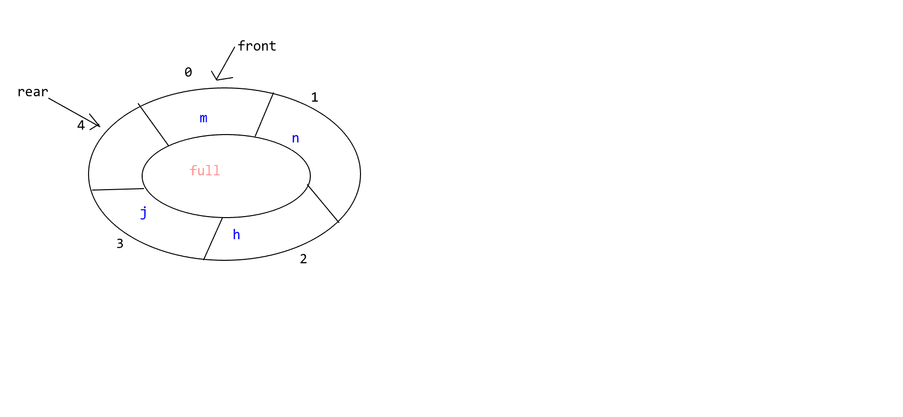

# 数据结构线性结构

## 队列

能实现“先进先出”的数据结构。（链式队列、静态队列）

### 一、链式队列
用链表实现

### 二、静态队列
用数组实现，通常是循环队列。

1. 为什么是循环队列
> 循环队列用数组实现，长度一般是固定的，若有数组出队，则原先的空间无法继续使用，会造成内存空间的浪费。 

2. 循环队列需要几个参数来确定
   
   > front , rear
3. 循环队列各个参数的含义
    > (1) 初始化队列，front 和 rear 都等于0；
    > (2) 若队列非空，那么front指向队列的第一个元素，rear指向队列的最后一个有效元素的后一位；
    > (3) 队列空，front和rear的值相等，但不一定为等于零。

4. 队列伪算法：
   1. 入队伪算法：
    > 1. 在rear指向的位置插入元素
    > 2. rear = (rear + 1) % 数组长度（实现循环）
   
   2. 出队伪算法：
    > 1. front = (front + 1) % 数组长度

5. 如何判断循环队列是否为空
   
   > front = rear 
   
6. 如何判断循环队列是否满了
   > 两种方式
   > 1. 多增加一个元素存储队列长度
   >
   > 2. 少使用一个参数（常用）
   >
   >     ```C
   >     // 这里的rear已经进行过一次rear = (rear + 1) % 数组长度 
   >     if ((rear + 1) % 数组长度 == front)
   >         已满
   >     else
   >         未满
   >     ```
   >     
   >     


### 用代码实现静态队列

```C
#include <stdio.h>
#include <malloc.h>
#include <stdbool.h>
#include <stdlib.h>

typedef struct Queue
{
    int * pBase;
    int front;  // 存储队首元素
    int rear;   // 存储队尾元素 
} QUEUE, *PQUEUE;

void init_queue(PQUEUE pQueue, int len);
bool en_queue(PQUEUE pQueue, int val, int len);
bool out_queue(PQUEUE pQueue, int * out_val, int len);
bool full_queue(PQUEUE pQueue, int len);
bool emput_queue(PQUEUE pQueue);
void traverse_queue(PQUEUE pQueue, int len);

int main(void)
{
    int out_val;
    QUEUE queue;
    init_queue(&queue, 10);
    en_queue(&queue, 1, 10);
    en_queue(&queue, 2, 10);
    en_queue(&queue, 3, 10);
    en_queue(&queue, 4, 10);
    en_queue(&queue, 5, 10);
    en_queue(&queue, 6, 10);
    en_queue(&queue, 7, 10);
    en_queue(&queue, 8, 10);
    en_queue(&queue, 9, 10);
    traverse_queue(&queue, 10);
    // en_queue(&queue, 10, 10);
    // en_queue(&queue, 10, 10);
    // en_queue(&queue, 10, 10);
    if (out_queue(&queue, &out_val, 10))
        printf("出队的值为：%d\n", out_val);
    else
        printf("出队失败!!!\n");
    traverse_queue(&queue, 10);
    return 0;
}

void init_queue(PQUEUE pQueue, int len)
{
    pQueue->pBase = (int * )malloc(sizeof(int) * len);
    pQueue->front = 0;
    pQueue->rear = 0;
}

bool en_queue(PQUEUE pQueue, int val, int len)
{
    if (full_queue(pQueue, len))
    {
        printf("队列已满！！！无法插入元素！！！\n");
        return false;
    }
    else
    {
        pQueue->pBase[pQueue->rear] = val;
        pQueue->rear = (pQueue->rear + 1) % len;
        return true;
    }
}

bool full_queue(PQUEUE pQueue, int len)
{
    if ((pQueue->rear + 1) % len == pQueue->front)
        return true;
    else
        return false;
}

bool out_queue(PQUEUE pQueue, int * out_val, int len)
{
    if (emput_queue(pQueue)) // 记得给函数一个(参数) QAQ
    {
        printf("队列为空，无法删除！！！\n");
        return false;
    }
    else
    {
        *out_val = pQueue->pBase[pQueue->front];
        pQueue->front = (pQueue->front + 1) % len;
        return true;
    }
}

bool emput_queue(PQUEUE pQueue)
{
    if (pQueue->rear == pQueue->front)
        return true;
    else
        return false;
}

void traverse_queue(PQUEUE pQueue, int len)
{
    int count = pQueue->front;
    printf("队列里的数值依次为：");
    while (count != pQueue->rear)
    {
        printf("%d    ", pQueue->pBase[count]);
        count = (count + 1) % len;
    }
    printf("\n");
}
```


### 队列的应用

和时间有关的操作都有队列的影子。


## 递归

一个函数直接或者间接调用自己

### 函数调用

当函数$A$调用函数$B$时，系统：

1. 将实参、返回地址发送给被调用函数$B$保存;
2. 为形参分配存储空间；
3. 将CPU控制交给函数$B$。

当结束调用时，系统：

1. 保存返回值；
2. 释放函数$B$的空间；
3. 按照返回地址返回函数$A$，并将CPU的控制权交给函数$A$。


### 递归必须满足的三个条件

1. 递归必须有一个明确的终止条件；
2. 递归处理的数据规模必须在递减；


### 循环和递归

理论上来说，用循环可以实现的问题都可以转化成递归来解决。

递归：

1. 
2. 占空间多
3. 易于理解

| 递归     | 循环     |
| -------- | -------- |
| 速度慢   | 速度快   |
| 占空间多 | 占空间少 |
| 易于理解 | 不易理解 |


### 递归的应用

1. 树 和 森林 就是以递归的方式定义的
2. 树 和 图 的很多算法就是由递归来实现的
3. 很多数学公式就是以递归的方式进行定义的（斐波拉契序列）
4. ・・・・・・

