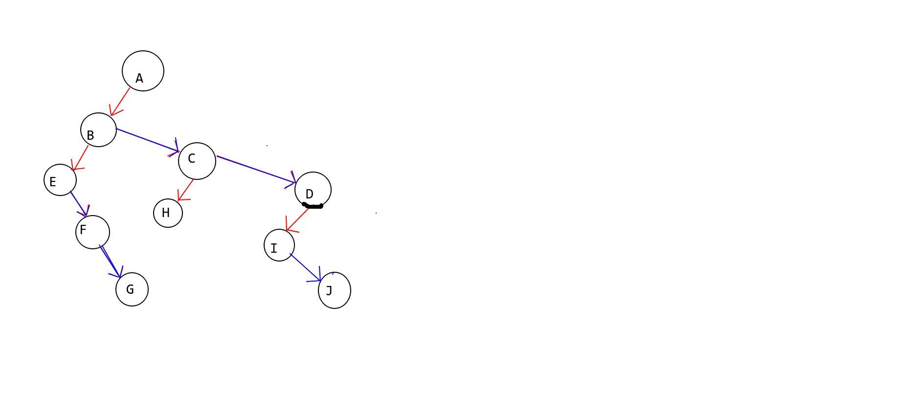

# 非线性数据结构


逻辑结构

1. 线性结构

    1. 数组
    2. 链表

    > 栈和队列属于线性结构的具体应用，不包括在线性结构的分类中。

2. 非线性结构

    1. 树
    2. 图

    

物理结构


# 树

### 一、专业术语

- 节点：树是由有限个元素组成的集合，每人元素都称作一个节点，上图A、B、 C、 D、 E、 F、G、H、I等都是树的节点;

- 节点的度：一个节点含有的子树的个数称为该节点的度;
- 叶节点或终端节点：度为0的节点称为叶节点，D,E,C,G都是叶节点;
- 非终端节点或分支节点：度不为0的节点;
- 子节点(孩子节点): 一个节点含有的子树的根节点称为该节点的子节点;
- 父节点(双亲节点)：若一个节点含有子节点，则这个节点称为其子节点的父节点;
- 兄弟节点：具有相同父节点的节点互称为兄弟节点;
- 堂兄弟节点：双亲在同一层的节点互为堂兄弟;
- 节点的祖先：从根到该节点所经分支上的所有节点;
- 子孙节点：以某节点为根的子树中任一节点都称为该节点的子孙;
- 森林：由m（m>=0）棵互不相交的树的集合称为森林;
- 树的度：一棵树中，最大的节点的度称为树的度;
- 节点的层次：从根开始定义起，根为第1层，根的子节点为第2层，以此类推;
- 树的高度或深度：树中节点的最大层次;


### 二、分类

- 一般树
    - 任意一个结点的子结点的个数都没有限制。
- 二叉树
    - 任意一个子结点的个数最多两个，并且子结点的位置不能更改（**有序树**）。
    - 分类
        - 一般二叉树
        - 满二叉树：在不添加新的层数的前提下，无法再添加一个结点的二叉树。
        - 完全二叉树：如果只是删除了满二叉树最底层最右边的连续若干个结点，这样形成的二叉树就是完全二叉树。完全二叉树包括满二叉树。
- 森林
    - $N$个不相交的树的集合


### 三、树的存储

> 计算机内存是一维的线性结构，而现实生活中还有很多的多维元素问题，我们需要通过数据结构将多维元素存储在一维结构中。

#### （一）二叉树的存储

##### 连续存储

将二叉树转换为完全二叉树后存储到数组中

- 优点：查找一个结点的父结点或子结点（包括判断这个结点有没有子结点）的速度很快。
- 缺点：耗用内存空间大。

##### 链式存储

通过指针域将分配的内存结点链接成一棵树。


#### （二）一般树的存储

##### 二叉树表示法

将一般树转化成二叉树后进行存储。

设法保证某一结点的：

1. 左指针域指向它的第一个孩子
2. 右指针域指向它的下一个兄弟

只要能满足这些条件，就可以把一个普通树转换为二叉树来存储。

> 示例：
>
> 一般树：
>
> ```mermaid
> graph	TD
> A --> B --> E; B--> F; B--> G; 
> A --> C; C --> H;
> A --> D; D --> I; D --> J
> ```
>
> 转换后：
>
> 


### 四、树的操作

#### 二叉树的遍历

##### 先序遍历

1. 先访问根结点
2. 先序访问左子树
3. 先序访问右子树

> 示例：
>
> 访问过程：
>
> ​	A -> B -> E -> F -> G -> C -> H -> D -> I -> J
>
> 
>
> 到达一个子结点后，将这个子结点的访问当作根结点的访问，接着对以这个结点为根结点的（子）树进行先序遍历，左子树访问完意味着该访问右子树，右子树访问完意味着包含“根”结点的这棵树访问完了---> 递归？

##### 中序遍历

1. 中序遍历遍历左子树
2. 访问根结点
3. 中序遍历右子树

##### 后序遍历 

1. 后序遍历左子树
2. 后序遍历右子树
3. 访问根结点


##### 已知遍历方法求原始二叉树

> 1. 知道 先序 + 中序 能求出来原始二叉树
>
>     > 看先序求每一段树的根结点，然后到中序找这个点并判断对应根结点的左右子结点
>
> 2. 知道 中序 + 后序 能求出来原始二叉树
>
>     > 
>
> 3. 知道 先序 + 后序不能求出来原始二叉树


### 五、树的应用

1. 树是数据结构数据组织的一种重要形式
2. 操作系统中子父进程的关系本身就是一棵树
3. 面向对象语言中类的继承关系本身就是一棵树
4. 赫夫曼树


### 六、树的实现

一个简单二叉树的实现：


