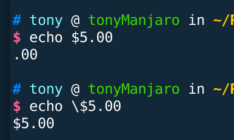

# 简单的命令操作


> 命令类型

1. 可执行程序
2. shell内置命令
3. shell脚本
4. alias命令 -> 可在其他命令的基础上定义命令（添加参数？）


zless 可以显示gzip压缩的文件内容


可以在一行内用 ; 分隔多条命令，这样在按下回车后就会执行多条命令


## 创建已有命令的别名
使用alias + 参数，创建已有命令的别名

```shell
alias cls='clear'
// 执行完毕后，cls可以产生clear的效果，注意：不能在等号两端添加空格

unalias cls='clear'
// 删除别名

// 注意：创建的别名只是临时的，退出shell就不存在了

alias 
// 查看已经存在的别名
```


## 重定向


使用 > 可以将输出重定向到指定文件内（从文件一开始处开始复制）

使用 < 可以将指定文件作为输入

使用 >> 可以将输出重定向到指定文件内（从文件末尾处开始复制）


## {}的用途

```shell
mkdir A_{1..5}-C
# 可以创建10个文件夹
# A_1-C, A_2-C, A_3-C, A_4-C, A_5-C 
```

## 转义字符 \

因为在shell中，“$, #, !, &, ...”具有特殊效果，但当这些字符搭配\使用时，这些字符的效果会消失，变成普通字符



```shell
可以用 echo  打印 \

当\放在'  '中时，\会被直接打印出来
``` 


# 高级键盘技巧


## 移动光标
|按键           | 功能   |
|-----------|------------|
|Ctrl + A    |光标移动到行首|
|Ctrl + E    |光标移动到行尾|
|Ctrl + B    |光标向后移动一个字符的距离|
|Ctrl + F    |光标向前移动一个字符的距离|
|Alt + B    |光标向前移动一个单词的距离|
|Alt + F    |光标向后移动一个单词的距离|

## 修改文本

|按键 | 功能  |
|----|----|
|  Ctrl + D | 删除光标处的字符  |
|  Ctrl + T | 将光标处的字符与前面一个字符对调位置  |
|  Alt + T | 将光标处的字与前面的字位置调换  |
|   Alt + L| 在bash下将光标处一直到字尾的字符换成小写  |
|   Alt + U| 在bash下将光标处一直到字尾的字符换成大写  |

## 剪切粘贴

|按键|功能|
|----|----|
|Ctrl + K|  剪切光标处直到行尾的文本|
|Ctrl + U|  剪切光标处直到行首的文本|
|Alt + D|   剪切光标处到当前词尾的文本|
|Alt + Backspace|剪切光标处到当前单词首的文本，如果当前光标在单词首，则剪切前一个单词|
|Ctrl + Y|  粘贴文本|

 
