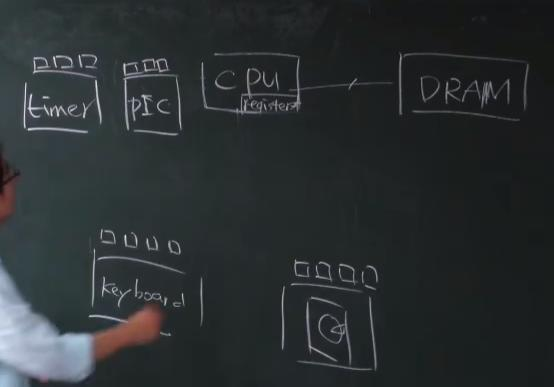
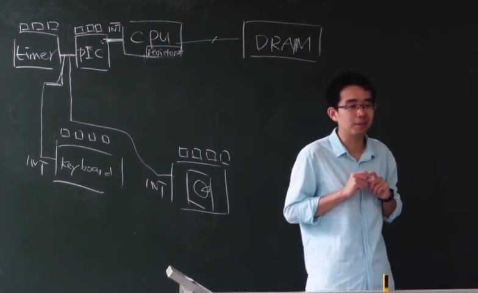
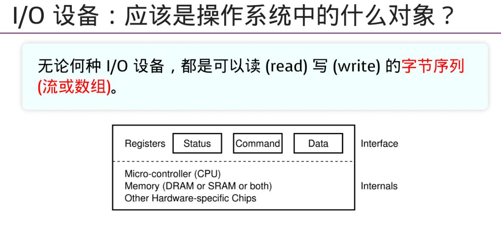

# 外部设备


设备是如何被抽象成操作系统的对象的

CPU眼中，IO设备就是一组寄存器（每个寄存器都有一个地址 —— 端口号） -> CPU向IO设备的寄存器中 读（out）/写（in） 数据
> CPU眼中IO设备是能与CPU交换数据的接口



---

特殊的IO设备：

---

中断控制器

有很多设备都会发出中断 —— 键盘中断、磁盘中断 ……，但计算机的资源是有限的，那么，如何选择先处理哪个中断？—— 将设备的中断信号线都连到**中断控制器**上



---

总线 —— 为了介入更多的设备

设备接到总线上，总线连接CPU

CPU将端口号发送给总线，总线根据端口号从设备上 `read/write` 数据

---

DMA：只能执行`memory_copy`  —— 提升性能

`disk` 的访问速度（数据传输速度）非常慢（`disk`准备好数据并向`CPU` 发出中断，`CPU`要将数据的读出到`Memory`  $\rightarrow$ `cpu 发出 memcpy` 的循环 $\rightarrow$ 产生大量的`CPU`占用），如何将`CPU`从这种大量的循环中解放出来？

引入`DMA` $\rightarrow$ 当需要从`disk` 中读出数据时，`CPU`将总线的控制权转交给`DMA`，`DMA`类似于一个`CPU`，可以提供`Memcpy`功能（由`DMA`来完成`读数据指令`的循环），当`DMA`完成所有数据的读出后，将总线的控制权转交给`CPU`


---

GPU

```shell

+-----+
| CPU
+-----+
  |||
  |||
+-----+
| GPU        # 根据代码算像素点  # 功耗的计算能力可能已经超过CPU了，但GPU的计算并不通用，仍是CPU的附属
+-----+
  |||
  |||
+-----+
|Display
+-----+
```

> 更专业做运算的GPU $\rightarrow$ CUDA，OpenCL

---

## IO设备的抽象

我们要把外设想象成数据对象（keybroad $\rightarrow$ 字符流；disk $\rightarrow$ 字节数组）

操作系统眼中，外设就是支持以下3种操作的数据对象（文件）：
> 1. read, 2. write, 3. ioctl



设备驱动程序就是将write、read、ioctl等系统调用指令`翻译`成外设（能看懂）的寄存器指令序列（包含端口号……）

设备驱动程序将设备抽象成了`对象 和 操作`

> 设备驱动为什么难写：
>
> 因为不同的设备具有不同的具体差异，很可能不能使用抽象层上相同的`接口` 
>
> 例如：disk并不支持单字节的读写，只能以`块（多个字节序列）`作为操作对象
> 
> 解决方法：disk使用bread/bwrite（block_read/write）一类的系统调用进行操作


