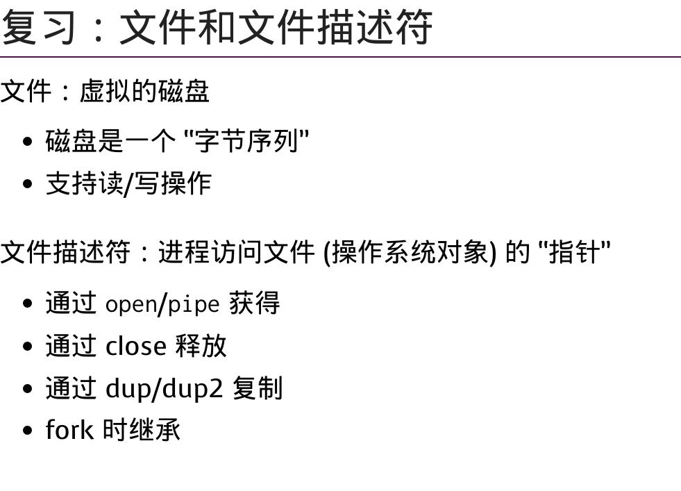

> 使用 `strace 命令i` 来查看命令调用了那些系统调用API
> 
> ```shell
strace ls -l /dev/null |& vim -
> ```

# 文件系统API

温故：

1. `CPU` 视角：外部设备 $\rightarrow$ 寄存器 

2. `OS` 视角：外部设备 $ \xrightarrow[]{（在驱动程序的辅助下）抽象成} $ 可读/写/控制的数据对象（寄存器）

3. 用户（应用程序）视角：`对象 + API` 
    > 中间层：`文件系统` 


```shell
    +--------+
    |应用程序
    +--------+
        ||
    +-------------------------+
    | OS                      |           
    |          file_system    | 
    +-device_dirver_program---+
        ||
    +--------+
    |外部设备
    +--------+

```

`vim main.c`：将磁盘上[xxx]位置的数据块当做`文件`使用


---

**文件系统API**

```shell
mount
umount

mkdir
rm

...

```
--- 

> 我们通过`disk`来理解文件系统

操作系统提供文件系统来让APPs使用`disk`的数据空间，而不是直接将`disk`暴露给APPs

文件系统 $\rightarrow$ 更好地管理`disk` 的数据空间

文件设备的设计目的：

1. 多个APPs共享数据

2. 提供隔离，防止恶意/无意损坏数据

文件系统 $ \xrightarrow[将文件映射到物理disk上]{虚拟化disk} $ `disk` 好像被分割成多个小块空间 $\rightarrow$ 用户在文件系统的辅助下来使用这些小块儿


> 文件：
>
> 1. 命名
> 
> 2. 查找
> 
> 3. 权限
> 
> 4. 指定文件大小
 
---


`disk` 被`file_system` 划分为树状结构：

```shell

./
├── 1.外部设备.md
├── 2.fs_api.md
├── demo/   # 目录/文件夹
│   ├── a.c
│   └── a.out
└── img/    # 目录/文件夹
    ├── io_on_os.jpg
    ├── IO_register.jpg
    └── PIC.jpg

2 directories, 7 files
```

> 文件$\rightarrow$ 数据，目录 $\rightarrow$ 容器

```shell
/

bin@    boot/    desktopfs-pkgs.txt     dev/    etc/    home/   lib@    lib64@
lost+found/     mnt/    opt/    proc/   root/   rootfs-pkgs.txt     run/    sbin@
srv/    sys/    tmp/    usr/    var/

```


---

UNIX/LINUX是如何管理多个外部设备（`disk` ）的？并不会像Window一样，插入U盘就多出一个盘符（例如：F盘）

> Everything is file!

插入U盘之后，/dev下多出一个文件

```shell
/dev
   ├── sda
   └── sdb  # 可能是U盘

```
---

```shell

# 列出disk
lsblk

# 将磁盘/u盘挂在到某一目录
mount /dev/sda ~/Project
# 挂载完毕后，ls ~/Project 会显示 sda 这块磁盘空间上的文件，
# 原 ~/Project 目录下的文件会暂时消失，直到 umount /dev/sda
# 文件系统把disk设备虚拟化成一棵文件树从而访问

```

我们也可以选择将一个`iso或img` 文件`mount`到一个目录下，这样做好像是把`iso或img`文件变成了一个设备

---

# 文件API

```c
read();
open();
write();
close();
```




父子进程写一个文件`log.txt` 

在`fork()` 时，子进程复制了父进程的文件描述符，但仍和父进程共享光标 $\rightarrow$ 防止进程互相覆盖写入的数据


