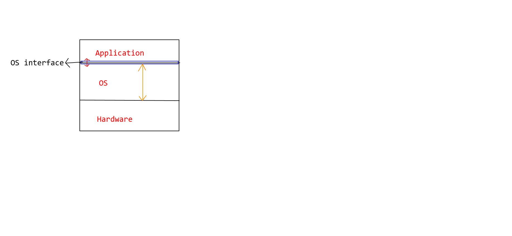

## 操作系统的接口（Ｌ4）


### 什么是接口？

连接两个东西、传输信号、屏蔽细节


### 什么是命令

命令就是**程序**，在命令行敲入命令就是在执行程序，在执行这些程序时调用一些重要函数（**操作系统接口**）对计算机资源进行使用

> 操作系统（linux）启动后，执行了一些初始化，然后开始执行一个shell（程序），等待用户输入命令（程序），然后执行命令（程序），最后打印结果
>
> ```C
> // 伪代码
> 
> /* 读取命令（程序）输入 + 执行命令（程序） */
> #include <stdio.h>
> 
> int main(int argv, char argc[])
> {
>     char cmd[20];
>     while (1)
>     {
>         scanf("%s", cmd);
>         // 对键盘进行使用
>         
>     	if (!fork) 
>         {
>             exec(cmd);
>         }
>         // 对CPU进行使用
>         
>         else 
>         {
>             wait();
>         }
>     }
> }
> ```

> ```c
> /* 打印结果 */
> # include <stdio.h>
> int main(int argv, char * argc[])
> {
>     printf("echo: %s\n", argc[1]);
> 	// 对显示器进行使用
> }
> ```


### 什么是图形按钮（一个应用程序）

硬件输入（鼠标点击、键盘按下 ...） -> 通过**中断**放入**消息队列**

应用程序是一个不断读取消息队列的循环，应用程序写一个GetMessage()函数，从操作系统中把消息队列拉上来，每拉上来一条，就执行一个对应的消息处理函数(这些用于消息处理的函数是实现对应功能的重要**接口**)。


### 什么是操作系统接口

一些**由系统提供的重要的函数**

1. 操作系统接口连接 操作系统 和 应用程序，程序通过调用操作系统的接口使用操作系统里的资源，通过操作系统的资源对硬件进行使用
2. 操作系统接口的调用表现为应用程序中函数的调用，又由系统提供，被称为系统调用（system_call）



> 个人理解：应用程序 嵌套 接口（函数），从而对操作系统进行使用，进而使用硬件资源

### 具体的操作系统接口

fork, open, write, read, ...


> Unix、Linux接口手册：POSIX（Portable Operating System Interface of Unix）
>
> ```由!IEEE制定```


##　系统调用背后的实现（Ｌ5）

### 为什么需要“系统调用”这个接口？

因为应用程序不能直接 调用/访问 操作系统内的资源（虽然应用程序和操作系统都被加载到内存中，但是操作系统内有root用户密码等重要信息，应用程序如果能访问的话太不安全了）


### 如何让应用程序不能访问操作系统内的资源？

进行设置，将内核程序与用户程序隔离，

> 1. 区分内核态和用户态： 一种处理器“硬件设计”

> 2. 让 内核段的权限（0） 比 应用程序段的权限（3） 高，这样一来应用程序就无法直接访问操作系统内的资源了。DPL（权限）> CPL（权限）
>
>     DPL：目标权限等级
>
>     CPL：当前（代码段）权限等级


### 系统调用如何实现？

通过中断（int指令）修改CPL权限，让用户程序能够访问内核，这是用户程序发起的调用内核代码的**唯一方式**。

系统调用的核心：

> 1. 用户程序使用了一段包含int指令的代码，发生中断（操作系统需要执行相应的中断处理程序）
>
>     > 在这里，这段代码由库函数提供，实际上是高级语言函数展开成一个带有系统调用号（执行相关中断指令的第几号功能）、int指令...的内嵌汇编代码的宏
>     >
>     > 1. 获得系统调用号
>     > 2. 执行int指令
>     > 3. ・・・・・・
>
> 2. 操作系统进行中断处理，通过编号执行相应代码（操作系统已经提前配置好中断处理程序）
>
>     


