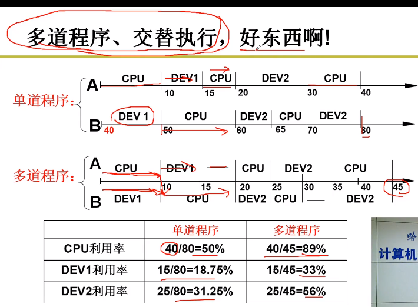

# 多进程

操作系统在管理CPU的时候引入了**多进程**图像

## 如何管理CPU

把PC设置为一段程序的初始值

> CPU 的工作原理：自动地 取指 -> 执行


CPU在执行程序时，在遇到需要CPU等待“很长”一段时间的指令时（如：IO指令 -> 需要IO设备读/写），先去执行其他（程序中的）指令，等原来的指令需要的工作完成后，再返回去执行原来（程序中）的指令（一直等着的话，CPU的使用效率就太低了（CPU使用效率 = CPU使用时间 / 程序执行总时间））

> 引入新的概念：

多道程序，交替执行 -> **并发**



> 并发的注意事项：

多道程序交替执行 -> 通过修改PC值来实现程序间的跳转，这就需要在跳转之前保留原来寄存器的值（例如：AX, BX ...）-> 记录跳转前的信息（用PCB记录）

> 新的概念：

进程（执行中的程序，需要记录信息）

```shell
进程与静态程序（放在磁盘中，未加载到内存）
```

> 操作系统启动多个进程，CPU来跑多个进程 -> CPU被很好地管理 

