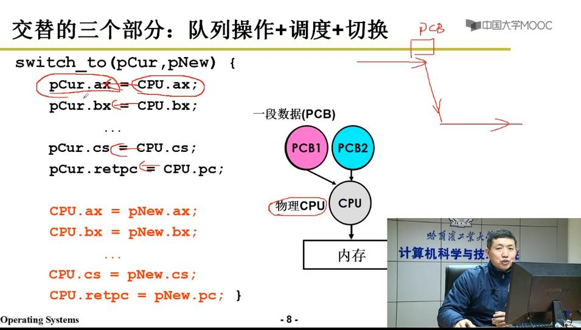

# 多进程管理 + 内存管理 == 多进程图像

## 1. CPU管理的直观想法（多进程管理）

CPU执行程序：在内存中一条接一条取指令执行（顺序执行）

但是这样工作效率并不高：因为会遇到IO操作 -> CPU工作仅依靠电路，而IO操作涉及磁壁访问，是机械操作，速度太慢，如果只依赖我们假定的顺序执行一个程序的方式，在进行IO操作时，CPU空闲下来，等待时间可能等于或超过计算时间，CPU的效率并不高。我们也不能让CPU跳过这条IO指令去执行该程序的下一条指令，因为接下来的指令很可能依赖于上一步IO操作读进来的数据。

这时候，就需要让CPU跳转执行另一个程序，直到IO操作完成后再决定下一步操作。


> 运行中的程序：进程，进程的状态信息存储在PCB表中。


引入新的概念：
> 多道程序，交替执行 -> **并发**
> 

> 并发的注意事项：

多道程序交替执行 -> 通过修改PC值来实现程序间的跳转，这就需要在跳转之前保留原来寄存器的值（例如：AX, BX ...）-> 记录跳转前的信息（用PCB记录）

> 新的概念：

进程（执行中的程序，需要记录信息）

```shell
进程与静态程序（放在磁盘中，未加载到内存）
```

> 操作系统启动多个进程，CPU来跑多个进程 -> CPU被很好地管理


## 如何实现多进程（略讲）

OS负责记录进程，按照合理的次序推进（分配资源、进行调度）


OS给每个进程建立PCB（process contorl block）结构，通过PCB推进各个进程。


> 多进程图像从启动开始到关机结束 

```c
例子：

Linux（liver server）一开机，打开一个shell（Windows一开机打开一个桌面），


main中的fork()创建第一个进程：
if (!fork)
{
    init();
}

shell再启动其他进程，启动完后再返回到shell
```

```C
// 启动磁盘读写
pCur_state = 'W';
// 将pCur放入磁盘
schedule();
// schedule内部：
schedule()
{
    pNew = getNext(ReadQueue);
    // 调度进程，从就绪队列中选择一个进程
    switch_to(pCur, pNew);
    // 切换队列->在PCB表中保存pCur的状态，恢复pNew
}


```


调度策略：
```c
1. FIFO
2. SJF
3. ……
```
> 考虑优先级


### 进程管理图像如何组织

OS用PCB感知进程，也用PCB组织进程

多个进程对应的PCB放在不同的地方 


## 2. 内存管理

虚拟内存映射物理内存

> 为了防止进程A在运行中影响进程B的数据，我们引入虚拟内存来提供对进程中数据的保护，使多个进程在内存中能“独立”存在

> [1000]映射到物理内存可能是0x23231


## 3. 多进程的合作

生产者与消费者
