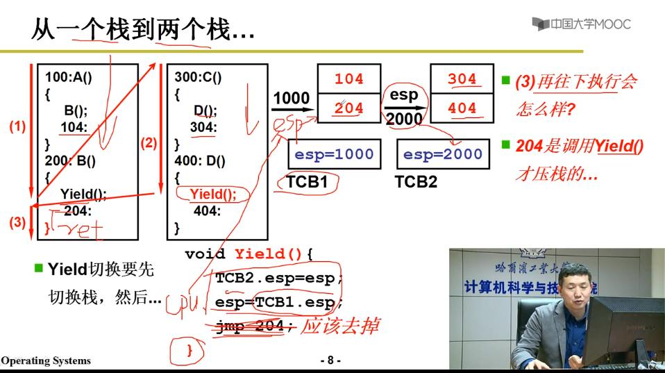

# 用户级线程（user-level thread）

通过浏览器的例子（先显示文本，再显示图片）来理解多线程的切换

> 我们假定浏览器从输入网址到显示文字和图片需要使用3个线程：
> 
> Thread_1: 从服务器接收数据，并放入buffer中；
> 
> Thread_2: 从buffer中读取文本内容，显示在浏览器端；      
>         
> Thread_3: 从buffer中读取图片，显示在浏览器端；
>         
> 当网页被打开时，先运行Thread_1，接收文本，接下来，切换运行Thread_2，显示图片，接下来，切换运行Thread_1，接收图片，接下来，切换运行Thread_2，显示图片。
>
> 如果不使用多线程切换，线程顺序执行，会发生什么：打开网页后，很久没有显示内容……

## 用户级线程的切换 —— yield()

注意：

1. 每个用户级线程使用自己单独的栈，当使用yield()函数进行线程的切换时，栈也被切换了

2. yield()函数的‘**}**’使用了ret，弹出了栈顶的一个返回地址，所以，图中的“**jmp 204**”应该被去掉。

3. yield()的前置函数：creatThread()设置TCB，线程的切换通过TCB表来告知切换到哪个用户线程。
