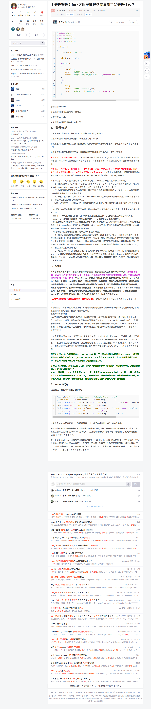
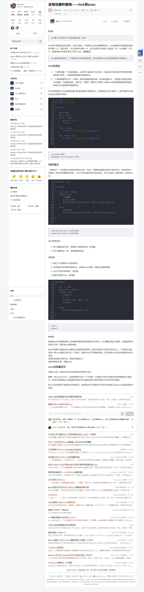

# 内核级线程

```C
user-level_thread_1    - user_stack_1
kernel-level_thread_1   - kernel_stack_1
user-level_thread_2    - user_stack_2
kernel-level_thread_2   - kernel_stack_2

kernel-level_thread_1的内核栈关联user-level_thread_1

kernel-level_thread_2的内核栈关联user-level_thread_2


```

五段论：

user-level_thread_1进行系统调用，进入kernel-level_thread_1，kernel-level_thread_1的内核栈保存user-level_thread_1的返回地址。接下来，如果发生磁盘读写等情况，kernel-level_thread_1阻塞，通过TCB表来进行寄存器等的设置，切换到kernel-level_thread_2，kernel-level_thread_2执行完毕后，借助kernel_stack_2来跳转到user-level_thread_2

> 在用户的角度上，只是进行了用户级线程间的跳转。


## 通过fork()来理解内核级线程的执行及创建、切换

有如下代码：
```C
int A(void)
{
    fork();
    B();    // ①
}

int B(void)
{
}

int fork()
{
    mov %eax, _NR_fork  // 传递系统调用号？
    int 0x80;
    mov res, %eax    // ②
}   // } 用于ret弹栈返回到A()
```

在执行到int 0x80前，信息都被保存在用户栈中
```shell
+----------------
| info_1
+----------------
| info_2
+----------------
| ...                # 以上都是A()的状态
+----------------
| ret = ①           # 返回到A()
+----------------
...
```

解读int 0x80

```s
; int 0x80产生中断，执行sys_call

sys_call:
    push    %ds
    ...
    pushl   %ebx
    
    call    sys_fork

    pushl   %eax
    movl    _current, %eax
    cmpl    $0, state(%eax)     ; 查看进程是否是运行态
    jne     reschedule          ; 如果不是运行态就进行调度
    cmp     $0, counter(%eax)   ; 查看时间片是否用完
    je      reschedule          ; 时间片用完就调度

;   当前进入内核栈，栈状态如下：
;    +----------------
;    | SS:SP            # 中断指令将用户栈指针push进栈，将用户栈与内核栈关联起来，方便从内核栈切换回用户栈
;    +----------------
;    | EFLAGS           # 标志位
;    +----------------
;    | ret = ②         #  中断返回到用户级指令
;    +----------------
;    | ds, es, fs
;    +----------------
;    | edx, ..., ebx
;    +----------------
;    | eax              # call  sys_fork 的下一句代码pushl  %eax
;    +----------------


ret_from_sys_call:
    popl    %eax
    ...
    pop     %ds
    iret            ; 用当前栈恢复CS:IP，恢复EFLAGS，恢复SS:SP
                    ; 从内核栈切换到用户栈，并从int 0x80的下一句代码开始执行

```

<details><summary>[fork()究竟复制了什么](https://blog.csdn.net/xy010902100449/article/details/44851453) </summary><p>

</p></details>

<details><summary>[fork()和exec()](https://blog.csdn.net/hanzheng6602/article/details/79971887) </summary><p>

</p></details>

---

> a question:
> ```shell
> 我想问一下，如果fork()后不执行exec类程序，那么，执行子进程时，是不是%eip指向的是内存中父进程fork()后一句指令
> ，，，，额，，，就是说子进程并未复制父进程的代码段，而是直接让%eip指向原父进程的代码段来执行，是这样吗 /*('_>')? 
> ```


## 进程切换

Linux_0.11 使用TSS来保存进程信息，并使用TSS中的信息进行内核栈的切换

现在我们要通过解析rescedule来分析内核级线程（实际上是进程）的调度了

```s

```

