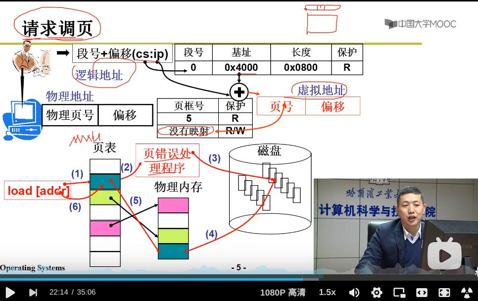

# swap in and swap out 

为了实现虚拟内存 

虚拟内存是连接分段和分页的关键

分段和分页是OS进行内存管理的关键

---

用户眼中：大而规整的内存空间 —— 段 —— 假象 —— 虚拟内存

$\downarrow$

**映射**到物理内存

---

## swap in —— 请求调页

假设实际物理内存只有1G，那么，如何给用户提供一种“有4G内存的错觉”？—— 内存换入


要使用用户眼中超过实际内存大小的虚拟地址空间时，将这段虚拟内存空间 **换入** 到物理内存——请求的时候换入并建立映射（因为物理空间的限制，无法将所有的虚拟内存段都载入到物理内存，无法全部在页表中映射） —— 请求调入页面并建立对页面的映射

**请求调页** ：用代码段举例：执行某条指令A，根据虚拟地址，MMU查页表，发现这条指令A的页号没有映射对应的页框号——不存在存储了这段程序的物理页，进程无法继续执行，进行中断（每执行一条指令就会去看中断寄存器是否为1，为1就进行中断） -> 中断处理 -> 从磁盘中将这段内容读到空闲物理内存页中（换入），并建立页表映射，再去执行没执行完的指令A（并不是产生中断的指令的下一条指令） -> 用户在执行这条指令的时候可能会觉得慢了一点



> A question：为什么使用“请求调页”而不是“请求调段”？
>
> 因为：

---

### 代码实现swap_in

从“中断“开始


```s
.globl
page_fault:
    
    ...
    
```

核心代码：

```c
void do_no_page(unsigned long error_code, unsigned long address)
{
    ...

    page = get_free_page();
    // 1. 申请页
    bread_page(page, current->executable->i_dev, nr);
    // 2. 从磁盘把程序装入页 —— 读文件系统
    put_page(page, address);
    // 3. 将虚拟内存和物理内存关联起来（填写页表）

    ...
}
```


## swap out

> 重点：LRU算法

有换出，物理内存才不会一直是满的 —— 空出地方，放置新的程序

换出发生在 `get_free_page()` 中


--- 

### 换出（页置出）算法：

- FIFO


---

- MIN —— 理想算法，但无法实现


---

- LRU —— 利用局部性原理，淘汰“最近最长一段时间内没有被使用的物理页（最近最少使用）” 

> 就像夏天很少有人买秋装和冬装一样，仓库会有货，但是不会摆在店里

> 现实中数据具有稀疏性，局部性，低质性


LRU算法只能近似实现，因为要想准确实现代价太大了

实现方法：SCR(Second Chance Replacement ) —— clock 算法 （再看一遍原理）

```shell
给每个页添加一个状态位：R
若这个页被访问，则设置R->1

添加两个指针：
    1. 指针A遍历页，查看R —— 若R==1，则设置R->0；若R==0，则置换该页 —— 当下次遍历时，置换掉R==0的页，
        因为这些页的状态位表示：在这个遍历周期内，这些页没有被访问过（如果访问过，R->1）

    但如果缺页很少，这就导致很少使用clock算法，这就导致了一个问题 —— 两次遍历周期过长，长到有足够的时间将
    之前被指针A变为0的页状态位置成1

    2. 这就需要加入指针B —— 定期将所有R置为0
```


### 应该给一个进程分配多少物理页？


分配太少 —— 造成**颠簸**—— 当进程太多时，分配给每个进程的物理页就少了，这就导致缺页现象频繁发生，当缺页率达到一定程度时，进程总需要等待调页，这大大降低了CPU的利用率（等待时间 > 使用时间）


如何应对颠簸：

1. 根据工作区来分配页帧（有对应算法） -> 例如：分配的页帧要能覆盖while()循环内的指令 -> 若不能满足覆盖循环体内的指令，那么就会不断发生 “缺页->swap out -> swap in -> 缺页 -> swap out -> swap in -> ...”的颠簸现象
2. 限制进程的数量——当进程的数量太多的时候，什么算法都无法应对颠簸


---


# 结合前面的内容


---

```shell

get_free_page()做了什么：申请物理页（这段物理页可能是空闲的，也可能是swap out了其他进程的程序段）

```

