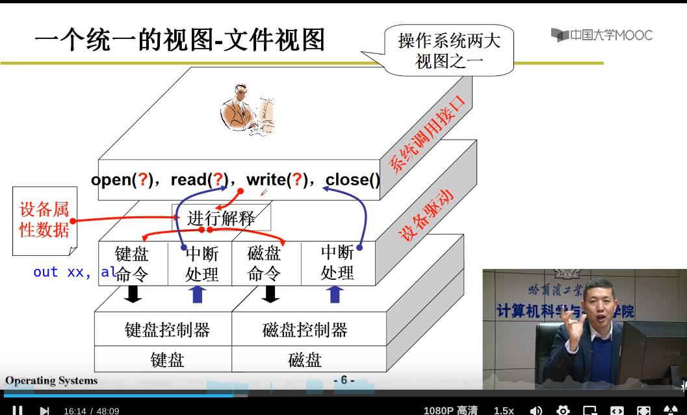

# IO

我们要学点什么：

1. 文件系统 —— 为所有外部设备提供一个统一的接口 —— 简化
    > 不论什么设备都提供`open()`，`write()`，`close()`，`read()`等接口（包装了out），参数是设备文件名（如：STDOUT(display)，STDIN(keybroad)……），根据设备文件找到控制器的地址（端口号）、内容格式 ……
2. `out port_number, al`
3. 文件操作完毕后向`CPU`发出中断





剖析一个`printf("Hello, world!\n");`

```c

// open(STDOUT)
// {
// }

// 先将格式化输出放到缓冲区中（buffer）

// 再用write()产生分支：到底要操作到哪个设备
write(1, buffer, count)
{
    // 找到具体要操作的设备是什么
}


int sys_write(unsigned int fd, char * buffer, int count)
{
    struct file * file;
    file = current->filp[fd];
    inode = file->f_inode;

}
```

在 `init()时，打开了/dev/tty0（终端设备）`，再复制两份（`dup(0)`，`dup(0)`）-> `stdin, stdout, stderr`


`printf("Hello, world!\n");`做了什么？


