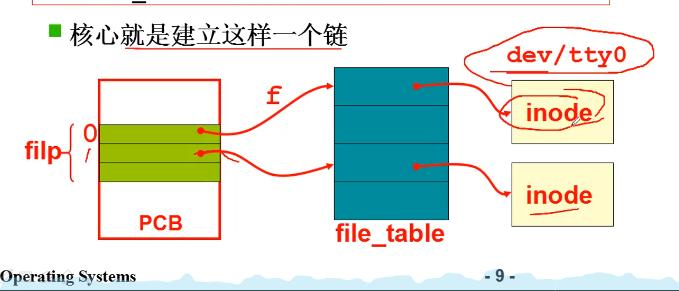

# 显示器的设备驱动


如何使用外设：在外设的控制器的`registers` 中读/写数据

我们要学点什么：

1. 文件视图 —— 为所有外部设备提供一个统一的接口 —— 简化
    > 不论什么设备都提供`open()`，`write()`，`close()`，`read()`等接口（包装了out），参数是设备文件名（如：STDOUT(display)，STDIN(keybroad)……），根据设备文件找到控制器的地址（端口号）、内容格式 ……
2. out  $port_{number}$, al
3. 文件操作完毕后向`CPU`发出中断


`用户程序` $ \xrightarrow[参数：1. 设备文件名(/dev/sda)，2.\cdots]{文件API(read(), write(), open(), close())} $ `驱动程序` $ \xrightarrow[in/out + port_{number}]{翻译成设备寄存器指令} $ `外部设备` $ \xrightarrow[工作完成后]{发送中断} $ `CPU`


---

显示器驱动

`printf("Hello, world\n");`

1. 创建`buffer = "Hello, world!\n"`

2. `write(1, buffer, ...)`


```c
// 文件号，buffer，数量
int sys_write(unsigned int fd, char * buffer, int count)
{
    file = current->filp[fd];
    // 从PCB表中的文件列表中找到要操作的文件是哪个 -> /dev/tty0
    inode = file->f_inode;
    // inode = current->filp[fd]->f_inode;  
    // /dev/tty0 的 inode
    // inode存储文件的信息（哪个设备，文件类型，……）

    // 根据设备类型判断是不是字符设备
    if (S_ISCHR(inode->i_mode))
        return rw_char(WRITE, inode->i_zone[0], buffer, count);
        // args：1. 操作，2. 什么设备，3. 字符缓冲，4. 字符数量
    ...
}
```



```c

void rw_char()
```

剖析 `sys_write` 流程：

文件描述符（fd = 1） $ \xrightarrow[]{索引具体文件 \rightarrow 索引设备信息}$  设备信息（`inode` ） $\xrightarrow[]{判断}$ 设备类型  + 设备号$\rightarrow$ 进行什么操作 $\rightarrow$  匹配对应驱动函数 $ \xrightarrow[buffer]{out\  port_{number}} $ 输出到显示器 

> 驱动程序就是写一堆包装了`out`的函数，再把函数关联到一张可索引的表中
>
> 将外部设备与这张表关联


