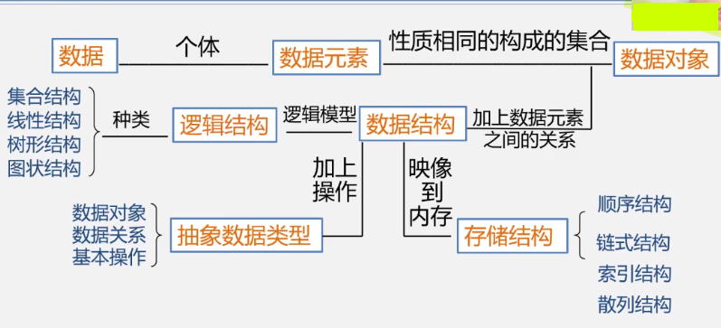
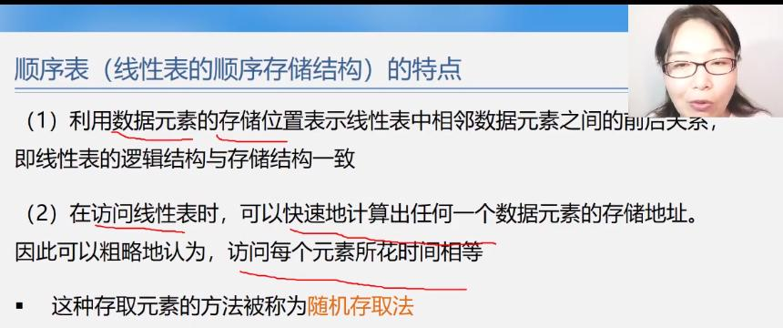
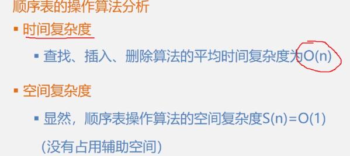
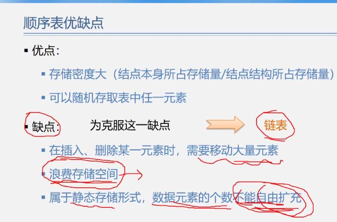

[TOC]

计算机专业的核心课程

多思考

多上机练习

画图学习


 

# 什么是数据结构？

数据元素之间的相互关系叫做**结构**。

**数据结构**是指相互之间存在着 一种或多种相互关系 的 数据元素 的 集合，或者说是带着结构的数据元素的集合。

## 数据类型

**什么是数据类型？**

数据类型：一组性质相同的值的集合（整数 / 浮点数 / 字符 ······）以及定义与这个值的集合上的一组操作的总称。

**抽象数据类型：**

> 抽象是从众多的事物中抽取出共同的、本质性的特征，而舍弃其非本质、个别的特征的过程。

```
ADT 抽象数据类型名
{
   数据对象:<数据对象的定义>
   数据关系:<数据关系的定义>
   基本操作:<基本操作的定义> 
}
ADT 抽象数据类型名
```

## 算法

**衡量算法的标准：** 

1. 正确性
2. 健壮性
3. 可读性 
4. 时间效率（T(n)）：大致等于 一个简单操作占用的时间 * 执行次数（因为每条语句的执行时间取决于软硬件环境，与算法本身无关，所以，我们需要考虑的是语句频度之和）

    - 事前统计
        常用
    - 事后分析
        编写程序
5. 空间效率


# 数据结构与算法

将数据元素按一定的位置关系存储起来，接下来对这些数据进行操作

存储结构：逻辑结构在物理存储单元上的映射。

## 线性表

### 线性表的特点
1. 一定数量的具有相同数据类型的数据元素按照次序排放的序列
2. 前驱，后继

#### 顺序存储的线性表 —— 数组
1. 把逻辑上相邻的相同类型的数据元素存储在物理上相邻的存储单元中的数据结构。
> 依序存储，地址连续

2. LOC(Ai) = LOC(A1) + Len * (i - 1) // Len 为单个元素的大小
> 便于取数

**实现：** 
关于顺序表的操作

1. 建立空表
   
    > 注意：不仅要建立空间，还要建立一个能记录当前表实际长度的变量
2. 销毁表
3. 插入元素
4. 删除元素
5. 查找元素
   
    > 返回给定元素的位置序号


```c

/*
  顺序存储的线性表 —— 数组
*/
#include <stdio.h>
#include <malloc.h>
#include <stdlib.h>
#include <stdbool.h>

#define MAXSIZE     100
#define OVERFLOW    -2
#define OK          true 
#define ERROR       false

typedef char elemType;

typedef struct sqList
{
    elemType * elem;
    int len;
} SqList;
// 需要两个参数：1. 数组， 2. 数组实际使用了的长度
// 只是确定了一个复合数据类型，只有在实际定义变量的时候才会占用内存空间

SqList initList(void); // 构建一张空表
void deleteList(SqList * pSqList);
bool locateElem(SqList * pSqList, elemType e); // 查找元素的内容，如果查找到，返回该内容所在位置序号
bool insertElem(SqList * pSqList, int position, elemType e);
elemType deleteElem(SqList * pSqList, int position); // 删除指定位置上的元素，并将该元素（的值）返回
void traversePrintList(SqList * pSqList);

int main(void)
{
    SqList list = initList();

    char i = 'a';
    for (int count = 0; count < 10; ++ count)
    {
        list.elem[count] = i;
        ++ i;
        ++ list.len;
    }

    insertElem(&list, 11, 'w');
    traversePrintList(&list);
    putchar('\n');
    deleteElem(&list, 2);
    traversePrintList(&list);
    putchar('\n');
    deleteList(&list);

    return 0;
}

SqList initList(void)
{
    SqList list;

    list.elem = (elemType *)malloc(sizeof(elemType) * MAXSIZE);
    if (!list.elem)
    {
        exit(OVERFLOW);
    }

    list.len = 0;

    return list;
}   

void deleteList(SqList * pSqList)
{
    if (pSqList->elem)
        free(pSqList->elem);
    else
       printf("List is not exsit!"); 
    return ;
}

bool locateElem(SqList * pSqList, elemType e)
{
    for (int index = 0; index < pSqList->len - 1; ++ index)
    {
        if (e == pSqList->elem[index])
            return index + 1;
            // 注意为什么是 index + 1
    }
    // 这个查找算法的复杂度如何算？
    // 这里使用顺序查找，一个一个找，符合要求就返回位置序号，不符合就接着找，直到找完整个线性表
    
    printf("该元素不存在\n");
    return ERROR;
}

bool insertElem(SqList * pSqList, int position, elemType e)
{
    if ((position < 1) || (position > pSqList->len + 1))
    {
        printf("插入失败，要插入的位置不合法。\n");
        return ERROR; 
    } 

    if (pSqList->len == MAXSIZE)
    {
        printf("线性表已满，无法插入新元素！\n");
        return ERROR;
    }
    // 考虑表满无法插入新元素的情况

    for (int index = pSqList->len; index > position - 1; -- index)
    {
        pSqList->elem[index] = pSqList->elem[index - 1];
    }
    // 该插入算法的时间复杂度计算：https://www.bilibili.com/video/BV1nJ411V7bd?p=19
    pSqList->elem[position - 1] = e;
    pSqList->len ++;
    
    return OK;
}

elemType deleteElem(SqList * pSqList, int position)
{
    if ((position < 1) || (position > pSqList->len))
    {
        printf("删除失败，所选位置不合理！\n");
        return '\0';
    }

    elemType e = pSqList->elem[position - 1];

    for (int index = position - 1; index < pSqList->len; ++ index)
    {
        pSqList->elem[index] = pSqList->elem[index + 1]; 
    }

    pSqList->len --;
    return e;

}

void traversePrintList(SqList * pSqList)
{
    for (int count = 0; count < pSqList->len; ++ count)
    {
        printf("%c  ", pSqList->elem[count]);
    }
}
```








#### 链式存储的线性表 —— 链表

用物理上任意的存储单元存储逻辑上相邻的线性表的数据元素。
> 这些存储单元可能是连续的，也可能不是连续的。

**一些要素：** 
1. 头指针
    指向链表的第一个结点
2. 头结点
3. 首元结点


#### 其他问题：

##### 有序表的合并问题

存在两个集合，每个集合内的元素都是有序的，现在要将这两个集合合并成一个集合，这个集合内的元素必须是非递减关系。
> 如：A = {1, 2, 3, 4}，B = {2, 3, 4, 5, 6}。合并成：C = {1, 2, 2, 3, 3, 4, 4, 5, 6}

两种方法：
1. 用顺序存储结构实现
2. 用链式存储结构实现

**关键：** 
使用指针对表中元素进行定位、比较、复制（解指针）

###### 顺序存储结构实现

新定义一张空表listC，用这张新表来存储listA和listB的所有元素

```C

void mergeList(SqList * pListA, SqList * pListB, SqList * pListC)
{
    ElemType * pA = pListA->elem;
    ElemType * pTailA = pListA->elem + (pListA->len - 1);
    ElemType * pB = pListB->elem;
    ElemType * pTailB = pListB->elem + (pListB->len - 1);
    ElemType * pC = pListC->elem;
    /*
     *  声明3个指针，分别指向3个顺序表的第一个数据元素的位置，通过指针的移动来比较、传递数据
     *  */


    while ( pA <= pTailA && pB <= pTailB)   // 什么时候结束循环？当其中一张表的所有元素都复制到listC中后，另一张表剩下的元素不用比较了，通过下面某个while循环将剩下的元素复制到listC中
    {
        if (*pA <= *pB)
        {
            *pC = *pA;
            pC ++;
            pA ++; // 如果是listA中的元素符合条件、被放入listC中，就让指针指向listA的下一个元素，让listA的下一个元素参与到下一轮迭代中，同样也让指向listC的元素的指针指向listC的下一个元素，以准备放下一个元素；listB的元素同理；
        }
        else 
        {
            *pC = *pB;
            pC ++;
            pB ++;
        }
    }


    /*
     *  通过下面几个步骤将表中剩下的元素复制到listC中
     *
     *  */

    while (pA <= pTailA) // listA有数据未拷贝到listC中
    {
        *pC = *pA;
        pC ++;
        pA ++;
    }

    while (pB <= pTailB) // listA有数据未拷贝到listC中
    {
        *pC++ = *pB++;
    }

    pListC->len = pListA->len + pListB->len;

    return ;
}
// 时间复杂度 = O(listA.len + listB.len);
// 空间复杂度 = O(listA.len + listB.len);
```

###### 用链式存储结构来实现

不用新分配空间，直接通过改变结点指针域的指针指向来构建新的链表

```C
pNode mergeList(pNode pHeadA, pNode pHeadB)
{
    pNode pA = pHeadA->pNext; // 让pA指向ListA的首元结点
    pNode pB = pHeadB->pNext; // pB同理
    pNode pHeadC = pHeadA;      // 让pHeadC指向ListA或ListB
    pNode pC = pHeadC;          // pC指针要不断移动 —— 指向新的被挂在ListC后面的结点，以准备挂再下一个新结点

    while (pA && pB)
    {
        if (pA->elem <= pB->elem)
        {
            pC->pNext = pA; // 
            pC = pA;
            pA = pA->pNext;
            /*
             * 让数值较小的结点挂在pC的后面，
             * 接下来让pC指向下一个结点的（刚才确定的较小的结点），已准备再将其他结点挂在链表的后面
             * pA指向ListA的下一个结点，以准备与pB所指向的结点的下一次数值比较
             * 当pA、pB的其中一个指针指向NULL时，代表其中一个表的所有结点都比较完毕了，结束while
             * 接下来在while的下面将另外一个表的剩下的结点挂在ListC后面就行了
             * 最后要释放另外一个表的头结点
             */
        }
        else
        {
            pC->pNext = pB;
            pC = pB;
            pB = pB->pNext;
        }
    }

    // 将剩下的元素接到链表的后面
    if (pA)
    {
        pC->pNext = pA;
    }
    else // if (pB) {}
    {
        pC->pNext = pB;
    }

    // 这两个if语句也可以写成：pC->pNext = pA? pA: pB

    free(pHeadB);

    return pHeadC;
    // 这个算法的时间复杂的和用顺序表实现的算法的时间复杂度相同
    // 空间复杂度为：O(1)。
    // 这个算法不需要在堆区重新开辟新的空间，只需要改变原来结点的指针域的指针的指向，从而构建出一条新的链表
}
```


##### 两张无序线性表的合并

存在两张无序线性表，实现对两张表的合并，并排除相同元素

**关键：** 
1. 将表B中的每一个元素与表A中的每一个元素进行比较（使用按值查找的算法）
2. 如果在A中有元素与当前元素相同，则丢弃当前元素，指向下一个元素；
3. 如过不相同，就将当前元素放到A表中，指针指向下一个元素


#### 三个案例分析

##### 1. 
##### 2. 稀疏多项式求和

###### 用顺序存储实现

```c
Polynome add(Polynome * pFormA, Polynome * pFormB)
{
    Polynome formC = creatPolynome();

    TermType * pC = formC.term;

    TermType * pA = pFormA->term;
    TermType * pATail = pFormA->term + pFormA->len - 1;
    // 设置指针，让指针分别指向式子A的首项和尾项
    // 特别要注意指针的类型必须和项的类型相同

    TermType * pB = pFormB->term;
    TermType * pBTail = pFormB->term + pFormB->len - 1;

    while ( (pA <= pATail) && (pB <= pBTail) )
    {
        if (pA->index <= pB->index)
        {
            if (pA->index == pB->index) // 不能写成 =
            {
                pA->coefficient = pA->coefficient + pB->coefficient;
                if (pA->coefficient) // 处理对应项相加为0的情况 —— 不进入if语句的块，直接让pA、pB指向下一个项，pC不变
                {
                    pC->coefficient = pA->coefficient;
                    pC->index = pA->index;
                    pC++;
                    formC.len++;
                }
                pA++;
                pB++;
            }
            else    // 处理 pA的指数<pB的指数 的情况
            {
                pC->coefficient = pA->coefficient;
                pC->index = pA->index;
                pC++;
                formC.len++;
                pA++;
            }
        }
        else
        {
            pC->coefficient = pB->coefficient;
            pC->index = pB->index;
            pC++;
            formC.len++;
            pB++;
        }
    }

    // 将剩下的项依次放入式子C中
    while ( (pA <= pATail) || (pB <= pBTail) )
    {
        if (pA <= pATail)
        {
            pC->coefficient = pA->coefficient;
            pC->index = pA->index;
            pC++;
            formC.len++;
            pA++;
        }
        else
        {
            pC->coefficient = pB->coefficient;
            pC->index = pB->index;
            pC++;
            formC.len++;
            pB++;
            
        }
    }


    return formC;
}
```


