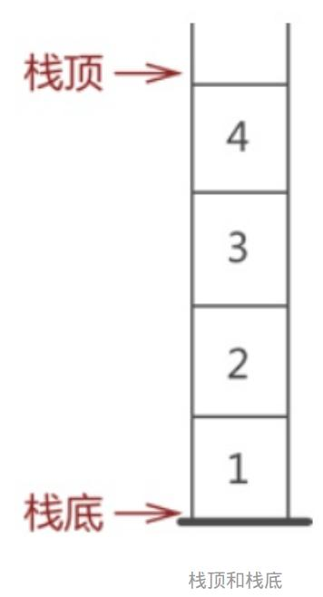

[TOC]


----


栈和队列都是操作受限的线性表 —— 只允许从表的一端进行插入和删除

# 栈 

栈 —— 后进先出 —— 只允许从表尾进行插入（入栈）、从表尾进行删除（出栈） —— 简称LIFO结构

表头：栈底

表尾：栈顶

## 栈的实现

### 顺序栈

**1. 栈数据类型：** 

```C
typedef struct SqStack
{
    ElemType * pTop;    // pTop 指向栈顶位置+1
    ElemType * pBase;   // pBase 指向栈底->指向下标为0的栈数据元素
    ElemType StackSize;   // 栈的最大元素承载个数 
} Stack, * pStack;
```

**2. 创建一个空栈：** 

```c
Stack initStack(int size)
{
    Stack stack;
    stack.pBase = (ElemType *)malloc(sizeof(ElemType) * size);
    if (!stack.pBase)
        exit(OVERFLOW);
    stack.pTop = stack.pBase;   // 设置空栈
    stack.StackSize = size;     // 设置栈的最大长度

    return stack;
}

```

**3. 销毁栈：** 

```c

void deleteStack(pStack p)
{
    if (p->pBase)
    {
        free(p->pBase);
        p->pTop = p->Base = NULL;
        p->StackSize = 0;
    }
    return ;
}

```

**4. 清空栈：** 

```c

void clearStack(pStack p)
{
    if (p->pBase) // 如果栈存在
        p->pTop = p->pBase;
    return ;    
}

```

**5. 数据入栈：** 

```c
STAUS push(pStack p, ElemType data)
{
    // 查看栈是否满
    if (p->pTop - p->pBase == p->StackSize)
    {
        printf("栈已满，无法入栈\n");
        return ERROR;
    }
    
    *(p->pTop) = data;  // 让数据入栈->放到此时p->pTop指向的位置
    p->pTop++;          // p->pTop 指向栈顶+1的位置
    // 上面两步可以写成 *p->pTop++ = data;
    return OK;
}

```

**6. 数据出栈：** 

```c
STAUS pop(pStack p, ElemType * popData)
{
    if (p->pTop == p->pBase)
    {
        printf("栈为空！无法出栈\n");
        return ERROR;
    }
    p->pTop--;          // 栈（顶）指针 - 1，等于数据出栈
    *popData = *(p->pTop);
    return OK;
}

```

**7. 从栈底开始遍历打印栈元素：**

```c
void traversePrintStack(pStack p)
{
    ElemType * pLocate;
    pLocate = p->pBase;
    printf("当前栈中元素如下：\n");
    while (pLocate != p->pTop)
    {
        printf("%d\n", *pLocate);
        pLocate++;
    }
    // 从栈底元素遍历到栈顶元素

    return ;
}

```

#### 总结：

1. 栈数据类型 —— 一个结构体，包括：
  - 两个指针：pTop（指向栈顶 + 1），pBase（指向下标为0的栈元素）；
  - 一个表示栈元素个数的变量；
2. 用栈数据类型创建一个结构体，并通过malloc()和pBase来创建一个顺序存储结构的栈，让pTop = pBase，表明这个栈为空
  - 接下来的所有关键操作都是基于使用指针pTop来定位数组元素（栈元素）来实现的；
3. 关键功能为入栈和出栈：
  - 数据入栈前要考虑栈是否满；
  - 数据出栈前要考虑栈是否为空；



### 链式栈

**1. 栈元素的数据类型：** 

```c
typedef int ElemType;

typedef struct stackElem
{
    ElemType data;
    struct stackElem * pNext;    
} StackElem, * pStackElem;  // 注意*

```

**2. 初始化栈：** 

链式栈不需要头结点

```c
pStackElem initStack(void)
{
    pStackElem pStack = NULL;
    return pStack;
}

```

**3. 入栈** 

注意第一个形参的类型：指向指针的指针

```c
STAUS push(pStackElem * pStack, ElemType pushData)
{
    pStackElem pPush = (pStackElem)malloc(sizeof(StackElem));
    if (!pPush)
    {
        printf("入栈失败！\n");
        exit(OVERFLOW);
    }
    pPush->pNext = *pStack; // 和普通单链表相反，栈的结点是通过
    pPush->data = pushData;
    *pStack = pPush;

    return OK;
}

```

**4. 出栈** 

注意第一个形参的类型：指向指针的指针

```c
STAUS pop(pStackElem * pStack, ElemType * popData)
{
    if (!*pStack)
    {
        printf("栈为空，出栈失败！\n");
        return false;
    }

    pStackElem pPop = *pStack;
    *popData = (*pStack)->data;
    *pStack = (*pStack)->pNext;
    free(pPop);
}

```


#### 总结

链式栈不需要像顺序栈一样先创建一块区域为栈，而是需要时才分配结构体变量的空间
1. 栈元素数据类型 —— 一个结构体：
    - 数据元素的类型
    - 指针 —— 前驱指针 —— n + 1 指向 n —— 恰好与单链表的指针指向相反
2. 对于push和pop，函数的形参是指向栈指针的指针 —— 因为需要修改栈指针的指向（通过对指针的指针解引用来实现）
3. 链式栈不需要头结点，只需要一个指向栈顶的指针，每次出栈入栈都需要修改 这个头指针的指向，所以，函数的形参都是 指向指针的指针。   

## 递归

什么是递归？

递归就是一个函数自己调用自己，在进行递归时，需要借助系统提供的栈。


# 队列

队列 —— 先进先出 —— 只允许从表头进行删除、从表尾进行插入 —— FIFO结构

最常见的是循环顺序队列

排队：多个用户要使用一个有限的资源。


## 队列的实现


## 用顺序存储结构实现循环队列

因为用顺序存储结构实现的普通队列出队的时候剩下的元素不需要移动位置，这就导致了可能出现假上溢的现象 —— 队列内有剩余空间，但不能继续入队，所以，需要使用“循环队列“来解决这一问题。

**1. 队列的数据类型：** 

```c
typedef int ElemType;

typedef struct circularQueue
{
    ElemType front; // 指向队首 -> 并不是指针，而是用front表示数组队列 队头元素的下标；
    ElemType rear;  // 指向队尾 -> 并不是指针，而是用rear表示数组队列 队尾元素的下标+1；每次入队时，都将新数据放在rear“指向“的位置，然后将rear后移；
    ElemType * base;   // 指向数组队列首元素的指针
} CircularQueue;
```

**2. 初始化队列：** 

```c
CircularQueue initQueue(void)
{
    CircularQueue queue;

    queue.base = (ElemType *)malloc(sizeof(ElemType) * QUEUESIZE);
    if (!queue.base)
    {
        printf("队列创建失败！\n");
        exit(OVERFLOW);
    }

    queue.front = queue.rear = 0;
    return queue;
}

```

**3. 清空队列：** 

```c
STAUS clearQueue(CircularQueue * pQueue)
{
    if (!pQueue->base)
    {
        printf("队列不存在！\n");
        return ERROR;
    }
    pQueue->rear = pQueue->front; 
    return OK;
}

```

**4. 删除队列：**

```c
STAUS deleteQueue(CircularQueue * pQueue)
{
    if (!pQueue->base)
    {
        printf("队列不存在！\n");
        return ERROR;
    }

    free(pQueue->base);
    return OK;
}

```


**5. 入队** 

入队之前需要判断队列是否满了

```c
STAUS enQueue(CircularQueue * pQueue, ElemType data)
{
    if ( (pQueue->rear + 1) % QUEUESIZE == pQueue->front )
    {
        printf("队列已满！无法入队！\n");
        return ERROR;
    }

    pQueue->base[pQueue->rear] = data;  // 注意使用的是pQueue->base[pQueue->rear]，而不是错误的pQueue->base[rear]。
    pQueue->rear = (pQueue->rear + 1) % QUEUESIZE;
    
    return OK;
}

```

**6. 出队：** 

出队之前需要判断队列是否为空

```c
STAUS dequeue(CircularQueue * p, ElemType * data)
{
    if (p->front == p->rear)
    {
        printf("队列为空，出队失败");
        return ERROR;
    }

    * data = p->base[p->front];
    p->front = (p->front + 1) % QUEUESIZE;

    return OK;
}

```

**7. 队列元素个数：** 

```c
int queueLength(CircularQueue * pQueue)
{
    if (!pQueue->base)
    {
        printf("队列不存在，返回-1\n");
        return -1;
    }

    return (pQueue->rear - pQueue->front + QUEUESIZE) % QUEUESIZE;  // 处理pQueue->rear < pQueue->front的情况。
}

```

#### 总结

1. 队列数据类型 —— 一个结构体：
    - 指向队列首元素的指针：base；
    - 两个下标：
        - rear：队尾元素 + 1
        - front：队首元素
2. 通过结构体来创建栈，用malloc()和xx.base来创建指定长度的队列
3. 实现循环：每次rear和front值的改变都是加一在对数组元素的最大个数取模，以此来实现循环。
4. 判断是否队空：pQueue->rear == pQueue->front。
5. 判断是否队满：因为是循环队列，所以我们不能通过pQueue->rear == pQueue->front来得出队列已满的方式，我们采用的是：当队列已满时，队列中留有一个未存储数据的空间（(pQueue->rear + 2) % QUEUESIZE == pQueue->front）。-->这种判断方式下，队列中不可能在某一时刻所有的单元都被使用，最少剩余一个存储单元。


###  用链式存储结构实现队列

**1. 队列的数据类型：**

```c
typedef int ElemType;

typedef struct queueNode
{
    ElemType elem;
    struct queueNode * pNext;
} QueueNode, * pQueueNode;

typedef struct queuePtr
{
    pQueueNode front, rear;
} QueuePtr;

```

**2. 初始化队列：**

```c
QueuePtr * initQueue(void)
{
    QueuePtr * pQueuePtr = (QueuePtr *)malloc(sizeof(QueuePtr));
    pQueuePtr->rear = pQueuePtr->front = (pQueueNode)malloc(sizeof(QueueNode)); // 创建一个头结点
    if (!pQueuePtr->rear)
    {
        printf("内存不足，创建失败！\n");
        exit(OVERFLOW);
    }
    pQueuePtr->rear->pNext = NULL;

    return pQueuePtr;
} 

```

**3. 入队** 

```c
STAUS enQueue(QueuePtr * pQueuePtr, ElemType data)
{
    pQueueNode pNewNode = (pQueueNode)malloc(sizeof(QueueNode));
    if (!pNewNode)
    {
        printf("队列已满，无法入队！\n");
        return ERROR;
    }

    pNewNode->elem = data;
    pQueuePtr->rear->pNext = pNewNode;
    pQueuePtr->rear = pNewNode;
    pQueuePtr->rear->pNext = NULL; // 入队一定要把队尾结点的指针域指向NULL

    return OK;
}

```

**4. 出队** 

```c
STAUS deQueue(QueuePtr * pQueuePtr, ElemType * data)
{
    if (pQueuePtr->front == pQueuePtr->rear)
    {
        printf("队列为空，无法出队！\n");
        return ERROR;
    }

    pQueueNode pDeQueue = pQueuePtr->front->pNext;
    *data = pDeQueue->elem;
    pQueuePtr->rear->pNext = pDeQueue->pNext;
    free(pDeQueue);
    
    // 当最后一个结点出队时，一定要让rear = front
    if (!pQueuePtr->front->pNext)
        pQueuePtr->rear = pQueuePtr->front;
    return OK;
}

```

**5. 遍历打印队列元素：**

```c
void traversePrintQueue(QueuePtr * pQueuePtr)
{
    pQueueNode pTraverse = pQueuePtr->front->pNext;
    printf("队列如下：\n");
    while (pTraverse)
    {
        printf("%d\n", pTraverse->elem);
        pTraverse = pTraverse->pNext;
    }

    return ;
}

```


## 总结顺序存储和链式存储的差异

||顺序存储结构|链式存储结构|
|---|---|---|
| 初始化 | 函数返回的是一个结构体，在初始化时就直接将所有元素的存储空间都创建 | 函数返回的是一个指向结点的指针，需要新加结点的时候才创建 |


