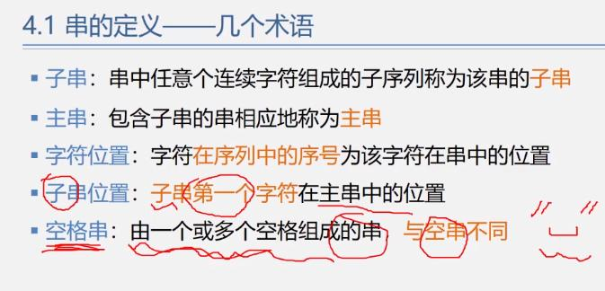

# 串（字符串）

内容受限的线性表 —— 只能是字符类型。

多个字符组成的序列

**一些术语：**



当且仅当两个字符串的长度相等、对应位置上的字符相同时，两个字符串才相等
> 所有的空串都是相等的


**重要内容：** 字符串匹配

## 串的数据类型

**1. 顺序串：**

```c
// 顺序串的数据类型：
#define STR_LEN     100
typedef struct string
{
    char elem[STR_LEN + 1];  // 为了方便操作，一般不用elem[0]来存储数据；
    int length;
} String;

```

**2. 链串：** 

因为如果用普通的链式串来存储数据，存储密度太小了（1 / 1+8），所以采用“块链“的方式进行存储——每一个结点都是同意长度的字符块儿（字符串）。

```c
// 链串的数据类型：
#define CHUNK_LEN   10
typedef struct chunk 
{
    char elemChunk[CHUNK_LEN];
    struct listString * pNext;
} Chunk;

typedef struct listString
{
    char * head, * tail;
    int stringLen;
} ListString;

```

## 串的模式匹配算法

定位：确定子串（模式串）在主串（正文串/目标串）内第一次出现的位置。

用途：
1. 文字处理软件的拼写检查
2. 搜素引擎
3. 翻译
4. 压缩

算法：
1. BF：简单匹配算法
2. KMP：


### BF算法

实现原理：
1. 将主串的第pos个字符与子串的第一个字符比较
    - 如果相同，持续比较后面的字符
    - 如果不相同，从主串的下一个字符起，重新与模式串的第一个字符比较（回溯）
2. 什么时候结束比较：
    1. 主串的最后一个字符被比完也没匹配成功 —— 返回0
    2. 子串的最后一个字符被比完 —— 匹配成功 —— 返回值为子串位置


# 数组

一维数组

多维数组

数组定义好后，维度和维界不会改变

对多维数组进行的操作：
1. 初始化，销毁
2. 查找元素，取元素
