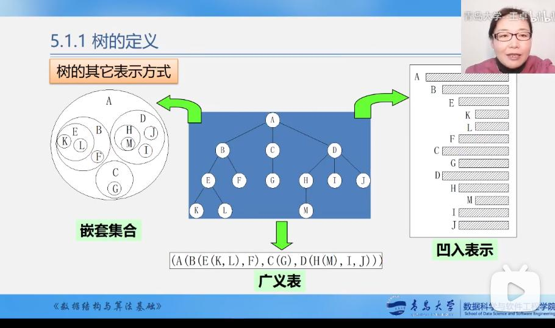
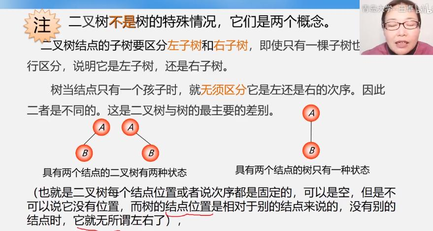
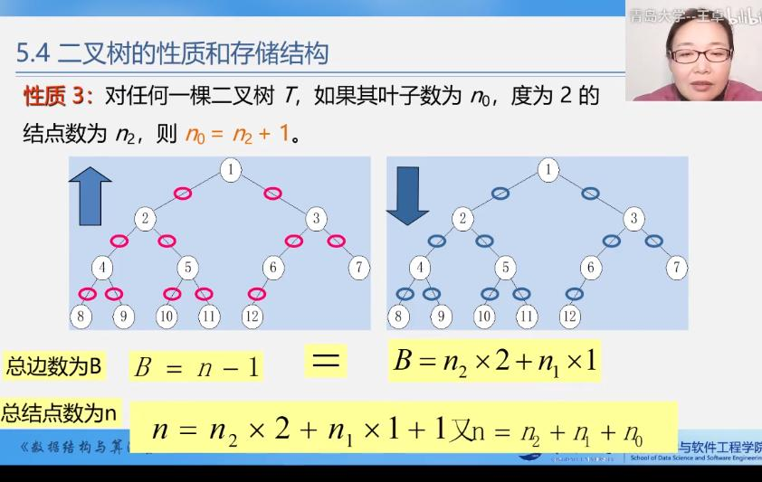
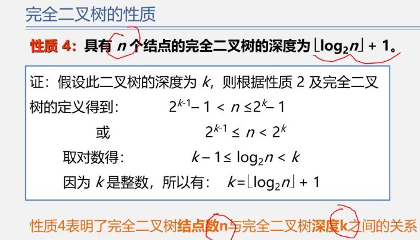
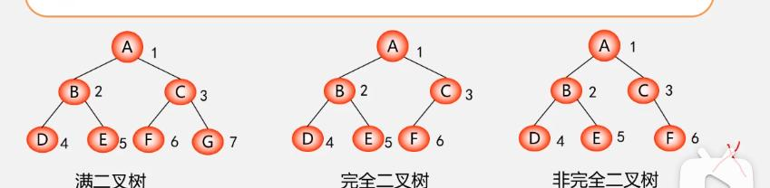
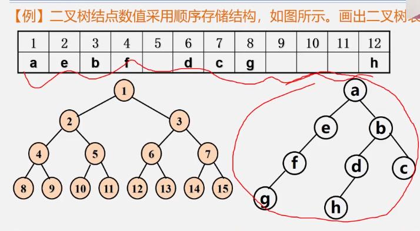
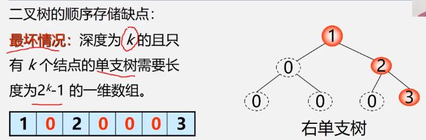
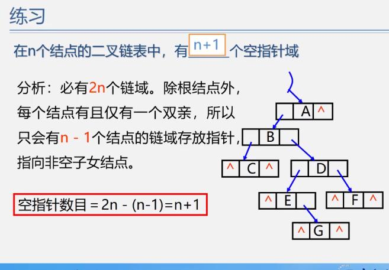

- [树的结构 —— 非线性结构](#-------------)
  * [术语](#--)
  * [二叉树](#---)
    + [二叉树的性质：](#-------)
    + [满二叉树和完全二叉树](#----------)
      - [满二叉树](#----)
      - [完全二叉树](#-----)
    + [二叉树的存储](#------)
      - [二叉树的顺序存储](#--------)
      - [二叉树的链式存储](#--------)
        * [二叉树的遍历](#------)

# 树的结构 —— 非线性结构

元素之间是一对多的关系

树的定义 —— 和递归有关


树的表示：
1. 嵌套集合
2. 凹入表示
    > 例如：图书目录
3. 广义表
4. 最常用的表示（中间那种）




## 术语

- 结点：树是由有限个元素组成的集合，每人元素都称作一个结点;
- 结点的度：一个结点含有的子树（后继元素，分支）的个数称为该结点的度;
- 树的度：一棵树中，最大的结点的度称为树的度;
- 叶结点或终端结点：度为0的结点称为叶结点，没有后继元素了。
- 非终端结点或分支结点：度不为0的结点，除了根结点以外的分支结点叫做内部结点;
- 子结点(孩子结点): 一个结点含有的子树的根结点称为该结点的子结点;
- 父结点(双亲结点)：若一个结点含有子结点，则这个结点称为其子结点的父结点;
- 兄弟结点：具有相同父结点的结点互称为兄弟结点;
- 堂兄弟结点：双亲在同一层的结点互为堂兄弟;
- 结点的祖先：从根到该结点所经分支上的所有结点;
- 子孙结点：以某结点为根的子树中任一结点都称为该结点的子孙;
- 森林：由m（m>=0）棵互不相交的树的集合称为森林;
- 结点的层次：从根开始定义起，根为第1层，根的子结点为第2层，以此类推;
- 树的高度或深度：树中结点的最大层次;
- 有序树：将任一节点的子树打乱顺序后得到一棵和原来不同的树
- 无序树：将任一节点的子树打乱顺序后得到和原来一样的树


## 二叉树




### 二叉树的性质：

1. 第$i$层上最多有$2^{i-1}$个结点，最少有1个结点。
2. 深度为$k$的二叉树最多有$2^{k}-1$个结点$(k\geq1)$，最少有$k$个结点。
3. 对于任何一颗二叉树$T$，如果叶子结点数为$n_{0}$，度为2的结点数为$n_{2}$，则$n_{0} = n_{2}+1$。
> 
4. 具有$n$个结点的完全二叉树的深度为$\lfloor log_{2}n \rfloor + 1$。
    
    注：$\lfloor x \rfloor$叫做$x$的根，表示不大于$x$的最大整数。
> 
5. 如果对一棵有$n$个结点的完全二叉树（深度为$\lfloor log_{2}n \rfloor + 1$的结点按层序编号，则对任一结点$i\; (1 \leq i \leq n$），有：
    1. 如果$i = 1$，则$i$是二叉树的根，无双亲；如果$i>1$，则其双亲是$\lfloor i/2 \rfloor$。
    2. 如果$2i > n$，则结点$i$为叶子结点；否则，其左孩子是结点$2i$。
    3. 如果$2i+1>n$，则结点$i$无右孩子；否则，其右孩子是结点$2i+1$。

### 满二叉树和完全二叉树

#### 满二叉树
    
一棵深度为$k$且有$2^{k}-1$个结点的二叉树为满二叉树 —— 每个分支结点都有两个结点。

**特点：**
1. 每一层上的结点数都是最大结点数（每层都满）—— 满二叉树在同样深度的二叉树中结点个数最多；
2. 叶子结点都在最底层 —— 满二叉树在同样深度的二叉树中叶子结点个数最多；


#### 完全二叉树

深度为$k$的具有$n$个结点的二叉树，当且仅当其每一个结点与深度为$k$的满二叉树中编号为$1 \sim n$的结点一一对应时，称为完全二叉树。

> 二叉树编号：从上到下，从左到右编号。



判断方法：

1. 把二叉树补成满二叉树，然后编号，看编号是否对应；
2. 将满二叉树删成完全二叉树，看编号是否连续。（没理解）

**完全二叉树的特点：** 

1. 叶子结点只能分布在层次最大的两层上；
2. 对任一结点，如果其右子树的最大层次是$i$，则其左子树的最大层次必为$i$或$i+1$。

**完全二叉树的性质：** 
见二叉树性质4、5

### 二叉树的存储

#### 二叉树的顺序存储

将树补全成完全二叉树，依次编号，存储在数组中（编号对应下标），用来补全的结点数据存为0/空/特殊字符。
> 



结点间的关系蕴含在其存储位置中，很可能浪费空间（存储密度降低），适合存储满二叉树和完全二叉树。


#### 二叉树的链式存储

**1. 二叉链二叉树的数据类型：** 

```c
typedef char ElemType;

typedef struct biNode 
{
    ElemType data;
    struct biNode * lChild, * rChild;
} BiNode, *BiTree;

```

二叉链二叉树结点数量和空指针域之间的关系：




##### 二叉树的遍历

一、二叉树的先序遍历

根节点 $\rightarrow$ 遍历左子树 $\rightarrow$ 遍历右子树


