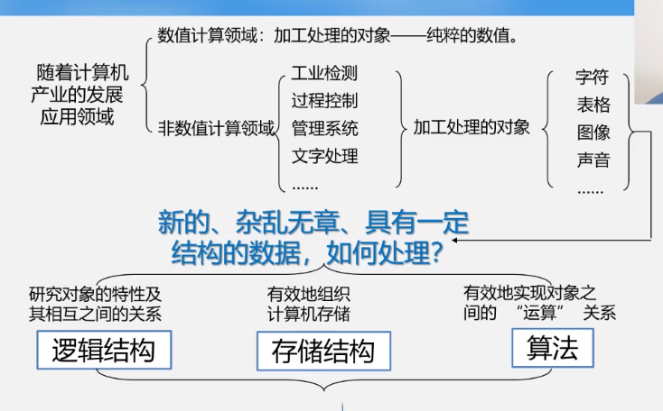
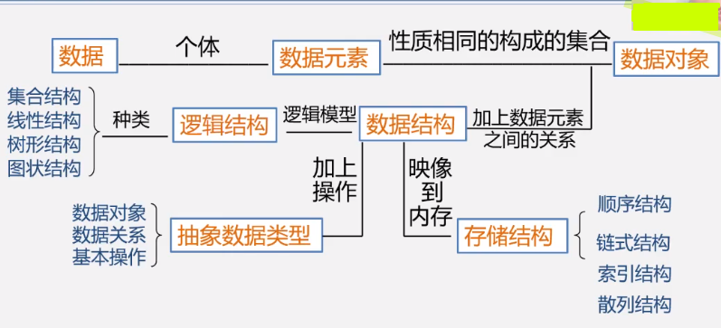
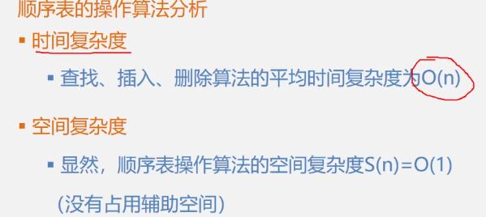

计算机专业的核心课程

多思考

多上机练习

画图学习



 

# 什么是数据结构？

数据元素之间的相互关系叫做**结构**。

**数据结构**是指相互之间存在着 一种或多种相互关系 的 数据元素 的 集合，或者说是带着结构的数据元素的集合。

## 数据类型

**什么是数据类型？**

数据类型：一组性质相同的值的集合（整数 / 浮点数 / 字符 ······）以及定义与这个值的集合上的一组操作的总称。

**抽象数据类型：**

> 抽象是从众多的事物中抽取出共同的、本质性的特征，而舍弃其非本质、个别的特征的过程。

```
ADT 抽象数据类型名
{
   数据对象:<数据对象的定义>
   数据关系:<数据关系的定义>
   基本操作:<基本操作的定义> 
}
ADT 抽象数据类型名
```

## 算法

**衡量算法的标准：** 

1. 正确性
2. 健壮性
3. 可读性 
4. 时间效率（T(n)）：大致等于 一个简单操作占用的时间 * 执行次数（因为每条语句的执行时间取决于软硬件环境，与算法本身无关，所以，我们需要考虑的是语句频度之和）

    - 事前统计
        常用
    - 事后分析
        编写程序
5. 空间效率


# 数据结构与算法

将数据元素按一定的位置关系存储起来，接下来对这些数据进行操作

存储结构：逻辑结构在物理存储单元上的映射。

## 线性表

### 线性表的特点
1. 一定数量的具有相同数据类型的数据元素按照次序排放的序列
2. 前驱，后继

#### 顺序存储的线性表 —— 数组
1. 把逻辑上相邻的相同类型的数据元素存储在物理上相邻的存储单元中的数据结构。
> 依序存储，地址连续

2. LOC(Ai) = LOC(A1) + Len * (i - 1) // Len 为单个元素的大小
> 便于取数

**实现：** 
关于顺序表的操作

1. 建立空表
   
    > 注意：不仅要建立空间，还要建立一个能记录当前表实际长度的变量
2. 销毁表
3. 插入元素
4. 删除元素
5. 查找元素
    
    > 返回给定元素的位置序号


```C
/*
 * 顺序存储的线性表 —— 数组
 **/
#include <stdio.h>
#include <malloc.h>
#include <stdlib.h>
#include <stdbool.h>

#define MAXSIZE     100
#define OVERFLOW    -2
#define OK          true 
#define ERROR       false

typedef char elemType;

typedef struct sqList
{
    elemType * elem;
    int len;
} SqList;
// 需要两个参数：1. 数组， 2. 数组实际使用了的长度
// 只是确定了一个复合数据类型，只有在实际定义变量的时候才会占用内存空间

SqList initList(void); // 构建一张空表
void deleteList(SqList * pSqList);
bool locateElem(SqList * pSqList, elemType e); // 查找元素的内容，如果查找到，返回该内容所在位置序号
bool insertElem(SqList * pSqList, int position, elemType e);
elemType deleteElem(SqList * pSqList, int position); // 删除指定位置上的元素，并将该元素（的值）返回
void traversePrintList(SqList * pSqList);

int main(void)
{
    SqList list = initList();

    char i = 'a';
    for (int count = 0; count < 10; ++ count)
    {
        list.elem[count] = i;
        ++ i;
        ++ list.len;
    }

    insertElem(&list, 11, 'w');
    traversePrintList(&list);
    putchar('\n');
    deleteElem(&list, 2);
    traversePrintList(&list);
    putchar('\n');
    deleteList(&list);

    return 0;
}

SqList initList(void)
{
    SqList list;

    list.elem = (elemType *)malloc(sizeof(elemType) * MAXSIZE);
    if (!list.elem)
    {
        exit(OVERFLOW);
    }

    list.len = 0;

    return list;
}   

void deleteList(SqList * pSqList)
{
    if (pSqList->elem)
        free(pSqList->elem);
    else
       printf("List is not exsit!"); 
    return ;
}

bool locateElem(SqList * pSqList, elemType e)
{
    for (int index = 0; index < pSqList->len - 1; ++ index)
    {
        if (e == pSqList->elem[index])
            return index + 1;
            // 注意为什么是 index + 1
    }
    // 这个查找算法的复杂度如何算？
    // 这里使用顺序查找，一个一个找，符合要求就返回位置序号，不符合就接着找，直到找完整个线性表
    
    printf("该元素不存在\n");
    return ERROR;
}

bool insertElem(SqList * pSqList, int position, elemType e)
{
    if ((position < 1) || (position > pSqList->len + 1))
    {
        printf("插入失败，要插入的位置不合法。\n");
        return ERROR; 
    } 

    if (pSqList->len == MAXSIZE)
    {
        printf("线性表已满，无法插入新元素！\n");
        return ERROR;
    }
    // 考虑表满无法插入新元素的情况

    for (int index = pSqList->len; index > position - 1; -- index)
    {
        pSqList->elem[index] = pSqList->elem[index - 1];
    }
    // 该插入算法的时间复杂度计算：https://www.bilibili.com/video/BV1nJ411V7bd?p=19
    pSqList->elem[position - 1] = e;
    pSqList->len ++;
    
    return OK;
}

elemType deleteElem(SqList * pSqList, int position)
{
    if ((position < 1) || (position > pSqList->len))
    {
        printf("删除失败，所选位置不合理！\n");
        return '\0';
    }

    elemType e = pSqList->elem[position - 1];

    for (int index = position - 1; index < pSqList->len; ++ index)
    {
        pSqList->elem[index] = pSqList->elem[index + 1]; 
    }

    pSqList->len --;
    return e;

}

void traversePrintList(SqList * pSqList)
{
    for (int count = 0; count < pSqList->len; ++ count)
    {
        printf("%c  ", pSqList->elem[count]);
    }
}
```





#### 链式存储的线性表 —— 链表

用物理上任意的存储单元存储逻辑上相邻的线性表的数据元素。
> 这些存储单元可能是连续的，也可能不是连续的。

**一些要素：** 

1. 头指针
    指向链表的第一个结点
2. 头结点
3. 首元结点
4. 

