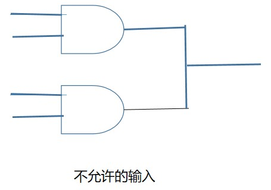

## 编码

编码 -> 信息的表示

计算机编码 -> 对编码的编码

在其他编码无法代替的情况下，这种编码为有效编码

========================================================================

## 电

导线接通后，负极流向正极，电能转化为热能（灯丝是电阻），电亮灯泡
（导线具有电子易流失性，流失后，向相邻原子借电子）

电压    
电阻
电流    

距离越远，电阻越大
横截面越大，电阻越小

距离太远，电压不够，电流不够电量灯泡，信息无法传递 -> 引入电报机

========================================================================

## 电报机与继电器

电报机：开关影响电流通过 -> 铁棒产生/消除磁力 -> 吸引上端铁棍发出声音

问题：距离带来的电压不够问题 -> 中间安置一个“继电器”（开关） -> 模仿开关的开和关（前一个继电器的输出作为下一个继电器的输入）

;-------------------------------------------------

;-------------------------------------------------

====================================================================

## 二进制

引入二进制

计算 13 * 11


> 二进制数的持续增长带来的变化规律：当所在位由1变为0时，其相邻的左边一位将发生改变

=========================================================================

## 布尔代数与逻辑计算

布尔代数是用来将“类”作为操作数的，传统代数将数量作为操作数

|      |      |      |      |      |              |      |
| ---- | ---- | ---- | ---- | ---- | ------------ | ---- |
| 交集 | 与   | AND  | *    | 串联 | 必须都符合   | &&   |
| 并集 | 或   | OR   | +    | 并联 | 符合一个就行 | \|\| |
|      | 非   | NOR  |      |      |              |      |


开关打开：0：不符合标准 

开关关闭：1：符合标准   


=============================================================================

## 开关与逻辑门

用继电器与带有灯泡的电路来模拟布尔逻辑 -> 门

门的本质就是看 继电器（两个继电器）开关状态（0/1） 与 带有灯泡的回路是否连通（是否有电流通过）（0/1） 的关系


> 继电器是门的核心
>
> 继电器开关的状态，导致灯泡的回路是否接通 -> 引入**门**的概念 -> 以下几个门就是 两个继电器/反向器 与带有灯泡的回路 串联/并联的结果

> 代入猫咪问题 -> 门的输入：
>
> 1. 前一个门的输出作为后一个门的输入
>
> 2. 看每个门的输入从哪来
>
> 3. 在连接门和反向器的时候有一些规则，影响它们的连接方式：一个门（或反向器）的输出可以作为一个或多个其他门（或反向器）的输入。但是两个或多个门（或反向器）的输出是不可以相互连接的（直接连在一起）。
>
>     


1. 与门（AND）—— 两个继电器串联

    

2. 或门（OR）—— 两个继电器并联

    

3. 非门（NOT）—— 反向器

    

4. 或非门（NOR）—— 输出正好和与门相反 —— 两个反相器串联

    

5. 与非门（NAND）—— 输出正好和与门相反 —— 两个反向器并联

    

6. 缓冲器 —— 单个继电器的作用：输入信号很微弱的时候，缓冲器就可以派上用场。之前提到过，这也就是很多年前在电报机中使用继电器的原因。另外，缓冲器还可以用于延迟一个信号。这是因为继电器需要一点时间——几分之一秒——才会被触发。

7. 异或门

    

    

> 一些逻辑：
>
> 


## 设计一个加法器（实现最高八位的运算）


两个8位数字相加最高可得一个9位数字

> 1111 1111 + 1111 1111 = 1 1111 1110

先设计一个半加器：


 

> 之所以叫半加器是有原因的，它将两个二进制数相加，得出一个加法位和一个进位位。但是绝大多数二进制数是多于1位的。半加器没有做到的是将之前一次的加法可能产生的进位位纳入下一次运算。

因为一般进行两个超过1位的二进制数相加 -> 导致每次是三个数相加 -> 不仅需要某一位置上的两个二进制数相加，还要加上右一位置产生的进位，所以设计全加器

> 我们只能将半加器用于最右面一列的相加：1加1等于0，进位1。对于从右面算起的第二列，由于进位位的存在，实际上需要将三个二进制数相加，而随后每一列的加法都是这样的。随后的每一列二进制数相加都需要将进位位算进来。


某一位置上的二进制数字相加 = A + B + 右一位置的两个数相加得到的进位（0/1）

> 最右端的两个二进制数相加时补上一个进位 **0**


```shell
# 需要144个继电器：

8 * (2 + (6 + 2) * 2)

```

1. 最终设计好的加法器：8个全加器（144个继电器）+ 9个灯泡

2. 第一个全加器的进位输入线接地，表示 0

    

3. 第1 ~ 7个全加器加和输出线接灯泡，进位输出线作为下一个全加器的进位输入线 

4. 最后一个全加器每根输出线接一个灯泡（共两个灯泡）

    


**最终的加法器：**


> 拓展一个用来处理两个16位二进制数相加的加法器：
>
> 


## 振荡器 -> 时钟


> 20Hz -> 每秒20次循环（20个周期）


